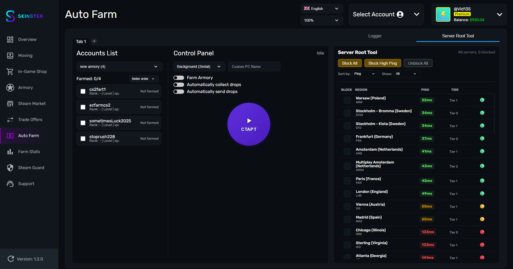
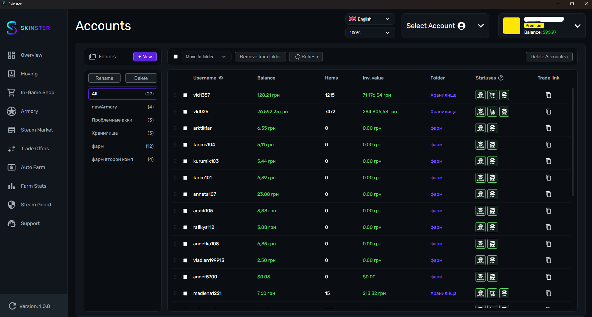
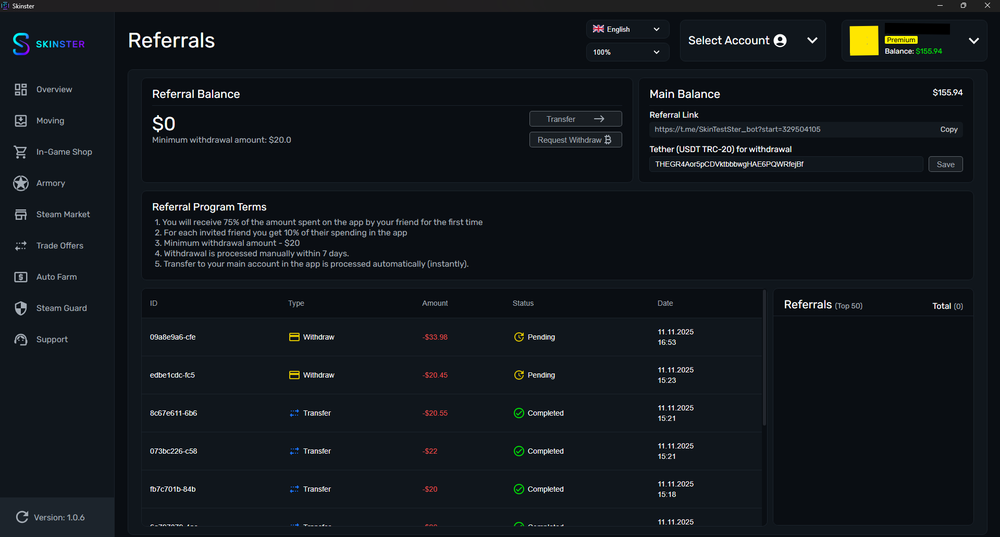
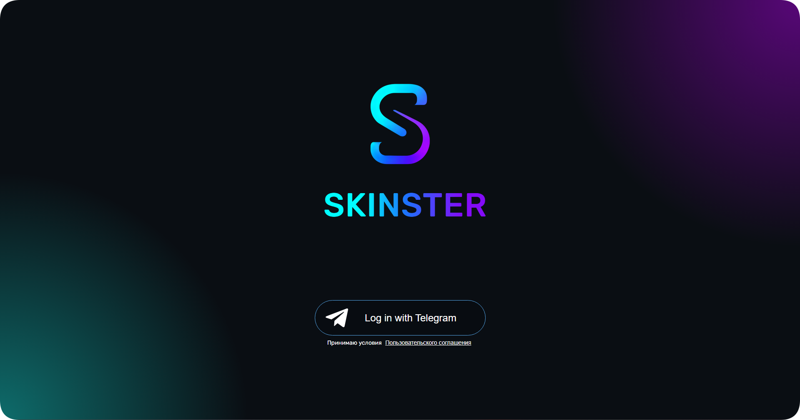

# Changelog

## Февраль 2026

v1.4.0


{% column width="41.66666666666667%" %}



{% column width="58.33333333333333%" %}
* 🗑 Steam Rewards
  * Убрана из раздела Accounts — после обновлений Steam функция потеряла практический смысл

* ⚙️ Движок фарм-модуля
  * Полностью переписан — фундаментальное обновление для быстрого внедрения новых возможностей

* 💡 Feature Request
  * Новый раздел для предложений от сообщества:
    * Любой пользователь может предложить идею
    * Другие могут дополнять её
    * Голосование за самые нужные функции

* 🗺 Roadmap
  * Процесс разработки стал прозрачнее — видно, что в работе и что планируется

* 🧪 Workflow (Experimental)
  * Новая страница для автоматизации действий (требует включения Experimental features)
  * Типы запуска:
    * По расписанию
    * После завершения другого Workflow
    * Вручную
  * Доступные действия:
    * Выбор аккаунтов для работы
    * Запуск / остановка фарма
    * Проверка и покупка Armory пропусков
    * Активация пропусков
    * Автоматическое открытие коллекций Armory
    * Отправка предметов по трейд-ссылке (фильтры по типу и цене)
    * Автоматическая продажа предметов (фильтры по типу, цене, стратегия продажи)
    * Автоматическое распределение по хранилищам (сортировка по типу и стоимости)
    * Настройка автоматического принятия трейдов (подарки/обмены, ограничение по аккаунтам)
    * Кастомные Telegram-уведомления




## Январь 2026

v1.3.4


{% column width="41.66666666666667%" %}



{% column width="58.33333333333333%" %}
* 🎨 Темы оформления
  * Добавлена возможность менять темы в приложении - 15 цветовых схем

* 🔑 Брелки (Страница Overview)
  * Добавлен функционал для снятия брелков с оружия

* 📦 Открытие контейнеров (Страница Overview)
  * Поддержка открытия:
    * контейнеров
    * капсул
    * сувенирных наборов
    * нашивок

* 🏆 Очки Steam (Страница Accounts)
  * Добавлена функция передачи очков Steam через награды:
    * профиль
    * скриншоты
    * арты
    * обзоры




v1.3.3


{% column width="41.66666666666667%" %}



{% column width="58.33333333333333%" %}
* 💰 Баланс на удержании
  * Теперь отображается баланс средств, которые находятся на удержании - не теряйте свои деньги

* 🎒 Overview
  * На странице Overview предметы без trade ban теперь отображаются первыми

* 🔁 Trade Offers: быстрый перенос
  * На странице Trade Offers появилась возможность перекидывать вещи на аккаунт, выбранный вверху приложения

* ✅ Автопринятие трейдов
  * Для случаев, когда трейды отправляются на авторизованный аккаунт, добавлена опция автоматического принятия

* 🐞 Исправление бага с автофармом
  * Исправлена ошибка, из-за которой при отсутствии путей к Steam и CS страница настроек зависала




v1.3.1


{% column width="41.66666666666667%" %}



{% column width="58.33333333333333%" %}
* 🔐 Steam Guard
  * Добавлена возможность привязки Mobile Steam Guard прямо в приложении, без использования SDA

* 📂 Работа с аккаунтами
  * Export / Import перенесены на страницу Accounts → Actions
  * Добавлен экспорт аккаунтов с сохранением структуры папок
  * Реализован импорт аккаунтов из ZIP-архива, созданного новым экспортом (удобно для переноса на другой компьютер без потери структуры)

* 🎟 Промокоды
  * Добавлена активация промокодов (кодов пополнения):
    * 1 к 1 на аккаунт
    * Равномерное распределение всех кодов между аккаунтами

* ⭐️ Prime
  * Появилась возможность покупки Prime сразу на аккаунты

* 🎮 Библиотека игр
  * Добавлена возможность добавлять игры в библиотеку сразу на несколько аккаунтов

* 🔧 Оптимизация и фиксы
  * Оптимизированы страницы Moving и InGameShop - теперь быстрее и стабильнее
  * Исправлена ошибка из-за которой не добавлялись аккаунты




## Декабрь 2025

v1.2.0


{% column width="41.66666666666667%" %}
<figure><figcaption></figcaption></figure>


{% column width="58.33333333333333%" %}
*   ⚡️Добавлен встроенный Steam Root Tool




v1.1.0


{% column width="41.66666666666667%" %}
<figure><figcaption></figcaption></figure>

<figure><figcaption></figcaption></figure>


{% column width="58.33333333333333%" %}
*   👤 Работа с аккаунтами

    * В разделе **Аккаунты** добавлена возможность менять порядок аккаунтов:
      * глобально
      * внутри папок
    * Для запуска фарма аккаунты теперь **обязательно должны находиться в папке**

* 🧠 Логика и порядок фарма
  * Добавлена возможность **запуска фарма в фоновом режиме**
  * Добавлен выбор порядка фарма аккаунтов:
    * **Auto** - автоматическое распределение аккаунтов
    * **Порядок из папки** - фарм запускается строго в том порядке, в котором аккаунты находятся в папке

* 🤖 Управление через Telegram
  * настройка параметров фарма
  * запуск и остановка фарма
  * запрос **скриншота экрана**
  * получение информации по текущим запущенным аккаунтам:
    * количество полученного опыта
    * данные по Armory
  * Генерация картинки с отчетом о ваших дропах за 7/30 дней или за все время




## Ноябрь 2025

v1.0.8


{% column width="41.66666666666667%" %}
<figure><figcaption></figcaption></figure>


{% column width="58.33333333333333%" %}
* 📁 Управление папками
  * Cоздавать папки
  * Удалять их
  * Переименовывать
  * Распределять аккаунты по папкам.

* 👤 Работа с аккаунтами
  * Добавление аккаунтов в выбранные папки
  * Удаление аккаунтов одним кликом
  *   Полный контроль над структурой вашего аккаунт-пула

* 🔍 Сканирование аккаунтов
  * Баланс аккаунта
  * Количество предметов в инвентаре
  * Общую стоимость всех предметов
  * Есть ли Prime
  * Доступна ли торговая площадка
  * Разблокирован ли доступ к соревновательным играм
  * Есть ли VAC или Community бан
  * Получение и копирование Trade link




v1.0.6


{% column width="41.66666666666667%" %}
<figure><figcaption></figcaption></figure>


{% column width="58.33333333333333%" %}
* **Referrals**— Добавлена реферальная программа позволяющая получать 10% от затрат ваших друзей




v1.0.0 — Initial Release


{% column width="41.66666666666667%" %}
<figure><figcaption></figcaption></figure>


{% column width="58.33333333333333%" %}
* **Overview** — просмотр инвентаря и хранилищ, общая стоимость предметов, подробная информация (название, качество, цена, трейдбан).
* **Moving** — быстрое и удобное перемещение предметов между инвентарём и хранилищами.
* **In-game Shop** — возможность покупать игровые предметы без входа в игру и без лимита в 20 предметов.
* **Armory** — активация пропусков и открытие любых коллекций.
* **Steam Market** — продажа предметов, а также отмена запросов на покупку и продажу.
* **Trade Offers** — создание обменов между аккаунтами и быстрая передача предметов на основной аккаунт.
* **Steam Guard** — генерация кодов авторизации, подтверждение и отклонение действий.
* **Auto Farm** — автоматический фарм еженедельного дропа и звёзд из Armory, сбор дропа и статистика по аккаунтам.



