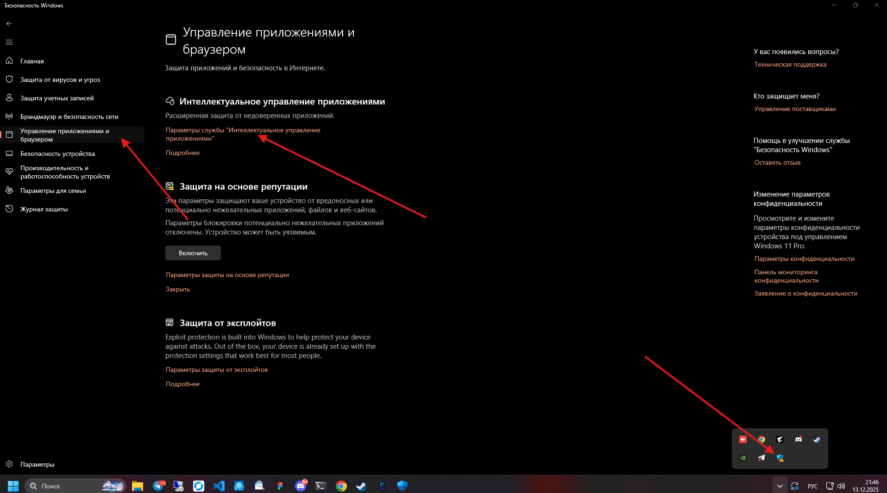

# Начало работы

❗️Начиная с версии v1.1.0 небходимо отключить "Интелектуальное управление приложениями" \
Это необходимо по той причине что приложение при первом запуске патчит виндовс для возможности запуска фарма в фоне.

1. Клацаем на стрелочку в правом нижнем углу и открываем "Безопасность Windows"
2. Переходим в раздел "Управление приложениями и браузером" и кликаем на текст "Параметры службы 'Интелектуальное управление приложениями'"
3. Выбираем опцию выключить
4. Теперь можно обновить/установить приложение
5. Затем необходимо перезагрузить пк

<figure><figcaption></figcaption></figure>

Первым делом необходимо добавить стим аккаунты. (Select account -> add account)\
&#x20;Существует 3 способа их добавления

1. username + password + steam guard code
2. Сканирование QR кода
3. Массовое добавление аккаунтов через log:pass фаил + maFiles\
   log:pass фаил должен содержать в себе данные авторизации для каждого аккаунта с новой строки\
   Например:\
   &#x20;                    username1:password1\
   &#x20;                    username2:password2\
   &#x20;                   и т. д.


Некоторые функции программы доступны только для аккаунтов добавленных через maFiles (Например: Trade Offers, Auto farm, Steam guard)



Skinster не хранит данные ваших аккаунтов на сервере, потому рекомендуется всегда иметь копию данных от аккаунтов


 
