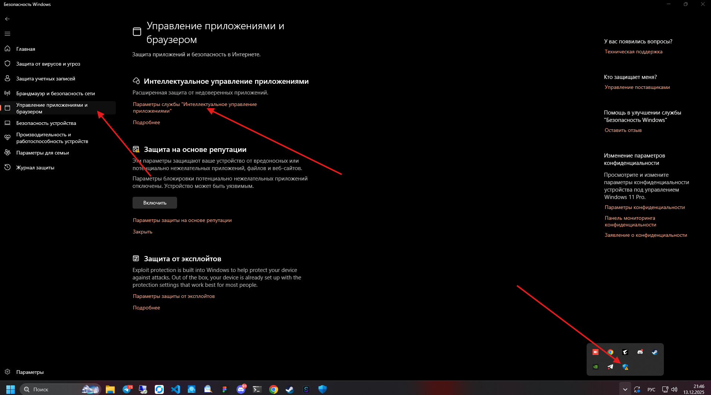

# Начало работы

Пошаговое руководство по настройке и запуску фарма в Skinster.

## Шаг 1: Отключение "Интеллектуального управления приложениями"

❗️Начиная с версии v1.1.0 необходимо отключить "Интеллектуальное управление приложениями"\
Это необходимо по той причине что приложение при первом запуске патчит виндовс для возможности запуска фарма в фоне.

1. Клацаем на стрелочку в правом нижнем углу и открываем "Безопасность Windows"
2. Переходим в раздел "Управление приложениями и браузером" и кликаем на текст "Параметры службы 'Интеллектуальное управление приложениями'"
3. Выбираем опцию выключить
4. Теперь можно обновить/установить приложение
5. Затем необходимо перезагрузить пк

<figure><figcaption></figcaption></figure>

## Шаг 2: Добавление аккаунтов

Перейдите в Select account -> Add account. Существует несколько способов добавления аккаунтов:

1. **Username + password + Steam Guard code** — ручное добавление одного аккаунта
2. **Сканирование QR кода** — авторизация через мобильное приложение Steam
3. **Массовое добавление через log:pass файл + maFiles** — рекомендуемый способ для фарма\
   log:pass файл должен содержать в себе данные авторизации для каждого аккаунта с новой строки:\
   &#x20;                    username1:password1\
   &#x20;                    username2:password2\
   &#x20;                   и т. д.
4. **Импорт ZIP архива** — если вы ранее использовали Skinster, вы можете импортировать ZIP архив из раздела Steam Guard. Архив сохраняет структуру папок и все данные аккаунтов.


Некоторые функции программы доступны только для аккаунтов добавленных через maFiles (Например: Trade Offers, Auto farm, Steam guard)



Skinster не хранит данные ваших аккаунтов на сервере, потому рекомендуется всегда иметь копию данных от аккаунтов


## Шаг 3: Сканирование аккаунтов

Выберите добавленные аккаунты и нажмите кнопку **Refresh** (Сканирование).

Это необходимо для того, чтобы панель получила актуальную информацию об аккаунтах — уровни, звания и статус недельного дропа. На основе этих данных панель сможет автоматически сортировать аккаунты для оптимального фарма.


Если у вас уже есть аккаунты расставленные в нужном порядке для фарма — этот шаг можно пропустить.


## Шаг 4: Запуск Auto Farm

Перейдите в раздел **Auto Farm** и выберите режим фарма:

### Локальный режим (Local)

Фарм происходит на текущем рабочем столе. Во время фарма окна CS2 будут видны на экране — не сворачивайте и не закрывайте их.

### Фоновый режим (Background)

Фарм происходит в отдельной Windows сессии, что позволяет продолжать пользоваться компьютером для других задач.


Рекомендуется запускать не более **2 параллельных фоновых сессий**. Можно попробовать запустить 3, но работа скорее всего будет очень нестабильной или не запустится вовсе.

