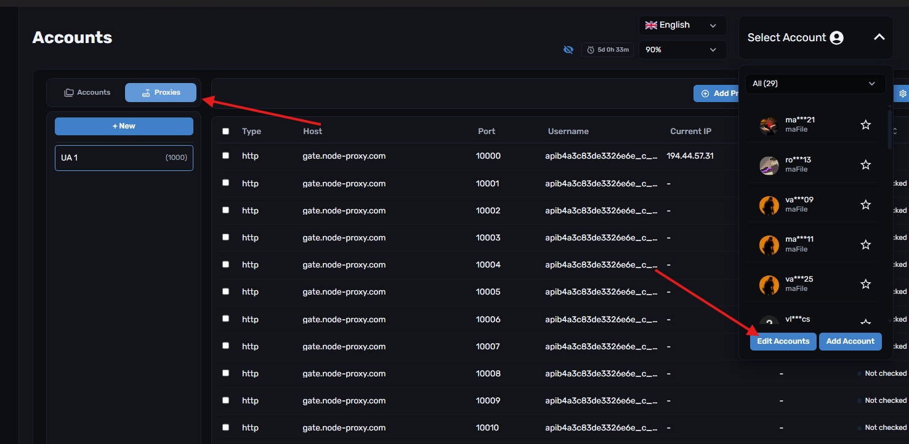
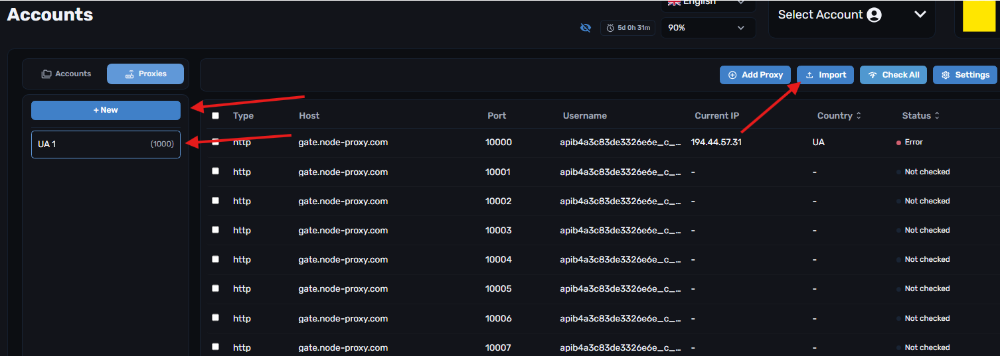
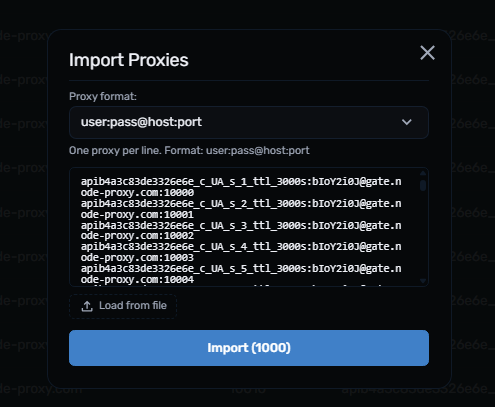
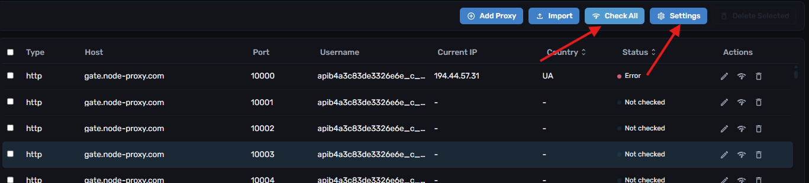
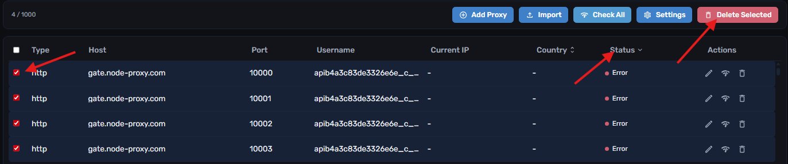
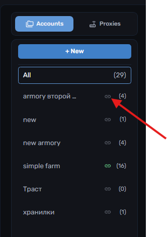

# Прокси

Использование прокси является опциональным и будет полезным для быстрого сканирования аккаунтов, а также если вы выставляете много предметов на продажу на торговой площадке.


Добавление прокси возможно в следующих форматах:\
`type://host:port:user:pass`\
`socks5://host:port:user:pass`


## Добавление прокси

**1.** Переходим на страницу **Accounts**, а затем в раздел **Proxies**

<figure><figcaption></figcaption></figure>

**2.** Создаем папку под наши прокси

<figure><figcaption></figcaption></figure>

**3.** Выбираем созданную папку и нажимаем **Импорт**

**4.** Вставляем наши прокси и сохраняем

<figure><figcaption></figcaption></figure>

## Настройка и валидация

**5.** В окне **Settings** можем указать для каких функций будут использоваться прокси, а также количество потоков для их валидации

**6.** Запускаем проверку прокси

<figure><figcaption></figcaption></figure>

**7.** Отсортируем и удалим невалидные

<figure><figcaption></figcaption></figure>

## Привязка прокси к аккаунтам

**8.** Переходим в раздел **Accounts** и кликаем на значок на папке, к которой хотим подключить прокси

<figure><figcaption></figcaption></figure>

**9.** Выбираем папку с прокси

**10.** Все готово — теперь панель будет автоматически использовать список ваших прокси для всех аккаунтов в выбранной папке

**11.** Если захотите убрать использование прокси — просто кликаем на значок повторно и нажимаем кнопку **Отвязать\Unlink**

