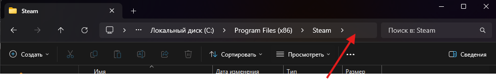

# Auto Farm

## Настройка

<figure><figcaption></figcaption></figure>

1. Первым делом переходим в раздел Settings (Настройки)
2. Необходимо указать путь к папке где установлен Steam (там должен находится фаил steam.exe)\
   В проводнике найдите свою папку и в верхней части где указан путь сделайте клик, это позволит выделить путь и скопировать его

<figure><figcaption></figcaption></figure>

3. Следующим действием надо указать путь к папке Counter-Strike Global Offensive\
   Если при установке вы не меняли папку то путь должен быть примерно таким \
   C:\Program Files (x86)\Steam\steamapps\common\Counter-Strike Global Offensive
4. Нажимаем кнопку Save (Сохранить)

### Уведомления в телеграмм (Опционально)

Для получения уведомлений во время фарма необходимо создать своего бота в телеграмм, для этого

1. Открываем @BotFather в телеграмм
2. Запускаем telegram app и нажимаем create bot
3. Придумываем Имя и username
4. Затем выбираем нашего бота и кликаем кнопку copy (токен бота скопирован)
5. Вставляем этот токен в поле №4 (см. скрин вверху)
6. Теперь переходим в @skinster\_bot и в главном меню можно найти свой ID
7. Его необходимо указать в поле №5  (см. скрин вверху)
8. Нажми кнопку Check (Проверить) что бы получить тестовое сообщение
9. Нажимаем кнопку Save (Сохранить)

