# Разбор функционала

**Auto Farm** автоматизирует фарм аккаунтов в Counter-Strike 2: панель сама запускает Steam и CS2, собирает лобби 2 на 2, играет матчи и забирает награды. Так можно фармить **еженедельный дроп** (кейсы, скины, граффити) или прокачивать **Armory** (звёзды боевого пропуска). Здесь разобраны все настройки, режимы запуска, расписание, инструмент управления серверами (SRT), статусы и горячие клавиши.


Auto Farm доступен по подписке с доступом к этой функции. Перед стартом необходимо указать пути к **Steam** и **CS2** в настройках, а также иметь хотя бы одну папку с добавленными аккаунтами.


## Прежде чем начать

Чтобы фарм запустился, нужно подготовить три вещи:

* Указать путь к **Steam** и к **CS2** в разделе **Settings**. Без них фарм не стартует — панель покажет предупреждение `Пожалуйста, укажите путь к Steam или CS2 в настройках перед началом фарма.` и перенаправит в настройки. Как именно указать пути — описано в разделе [Auto Farm](README.md).
* Создать папку и добавить в неё аккаунты **с mafile**. Если папок нет, при открытии страницы появится окно `Папка не выбрана` с текстом «Для начала фарма необходимо создать папку и добавить в неё аккаунты» и кнопкой **Перейти к Аккаунтам**.
* Иметь активную подписку с доступом к Auto Farm.

## Обзор экрана

**1.** Страница состоит из трёх зон. Слева — **Список аккаунтов** с выбором папки. По центру — **Панель управления** с настройками и кнопками запуска. Справа — переключаемые панели **Логгер** и **Управление Серверами**. Сверху расположены вкладки: каждая вкладка — это отдельная конфигурация фарма (можно вести до 5 вкладок параллельно).

<figure>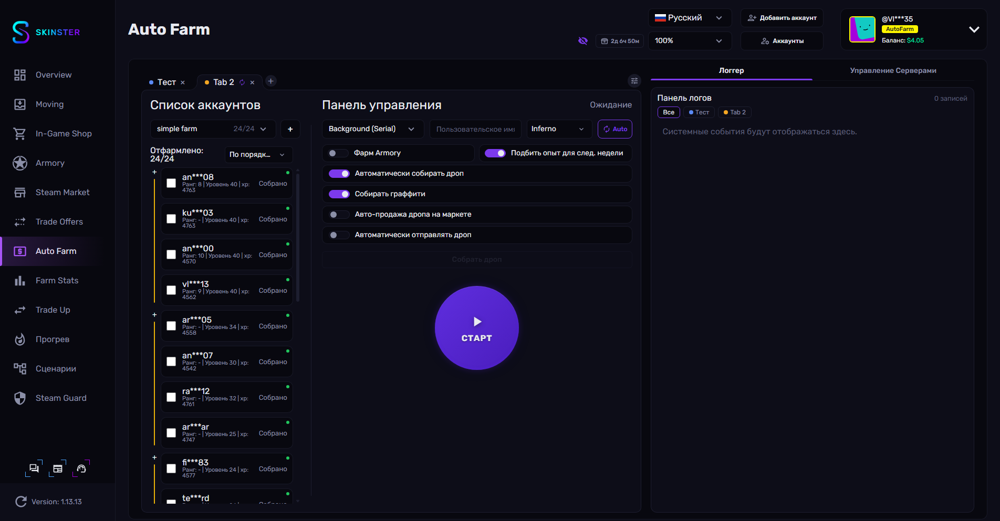<figcaption></figcaption></figure>

## Выбор аккаунтов

**2.** В левой части выбираем папку из выпадающего списка — рядом показано, сколько аккаунтов в ней уже отфармлено (например `24/24`). Кнопкой **+** можно добавить папку в очередь: тогда после отфарма одной папки панель автоматически перейдёт к следующей. Очередью можно управлять (**Переместить вверх**, **Переместить вниз**, **Убрать из очереди**).

<figure>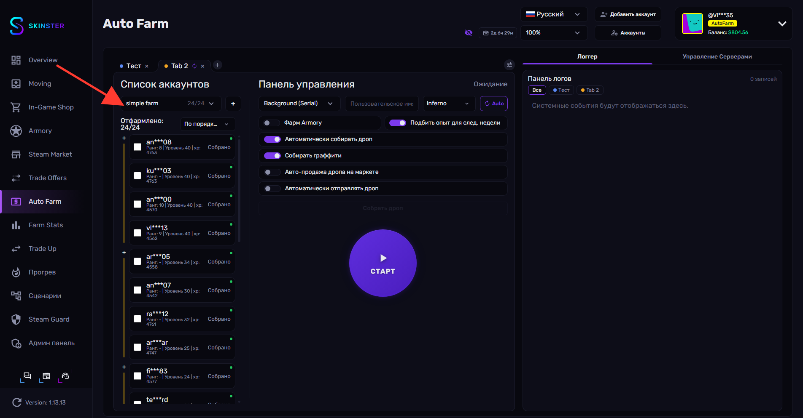<figcaption></figcaption></figure>

Над списком отображается индикатор **Отфармлено: X/Total** и выпадающий список сортировки. Доступные варианты сортировки:

| Параметр | Описание |
| --- | --- |
| **Авто (ранг + уровень + xp)** | Универсальный порядок по совокупности показателей |
| **По порядку папки** | В порядке добавления в папку; включает деление на **пачки** по 4 аккаунта |
| **По рангу** | По рангу Wingman |
| **По уровню** | По уровню профиля |
| **По XP** | По количеству опыта |
| **Уровень + XP** / **Ранг + Уровень** | Комбинированные сортировки |

В режиме **По порядку папки** слева от каждой группы появляется кнопка **+** (**Добавить пачку к выбору**) — она выбирает сразу всю пачку из 4 аккаунтов. У каждого аккаунта есть цветовой статус:

| Статус | Значение |
| --- | --- |
| **Собрано** | Дроп за неделю уже собран |
| **Отфармлено, но не собрано** | Дроп готов, но ещё не забран |
| **Не отфармлено** | Аккаунт ещё не фармил на этой неделе |

## Режим фарма

**3.** В **Панели управления** первым выбираем режим запуска. Доступны два режима:

<figure>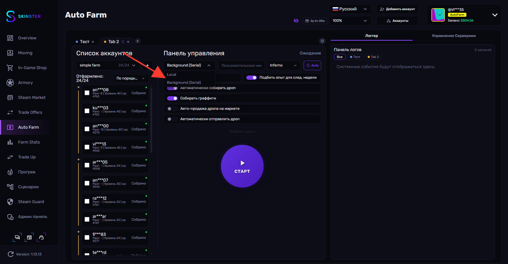<figcaption></figcaption></figure>

* **Local** — фарм запускается на вашем компьютере с открытием окон CS2; вы видите процесс и можете управлять вручную.
* **Background (Serial)** — фоновый режим: панель запускает аккаунты по очереди без видимых окон, всё происходит автоматически.

## Настройки

### Общие настройки

**4.** Рядом с режимом задаём базовые параметры: **Custom PC Name**, карту и расписание.

<figure>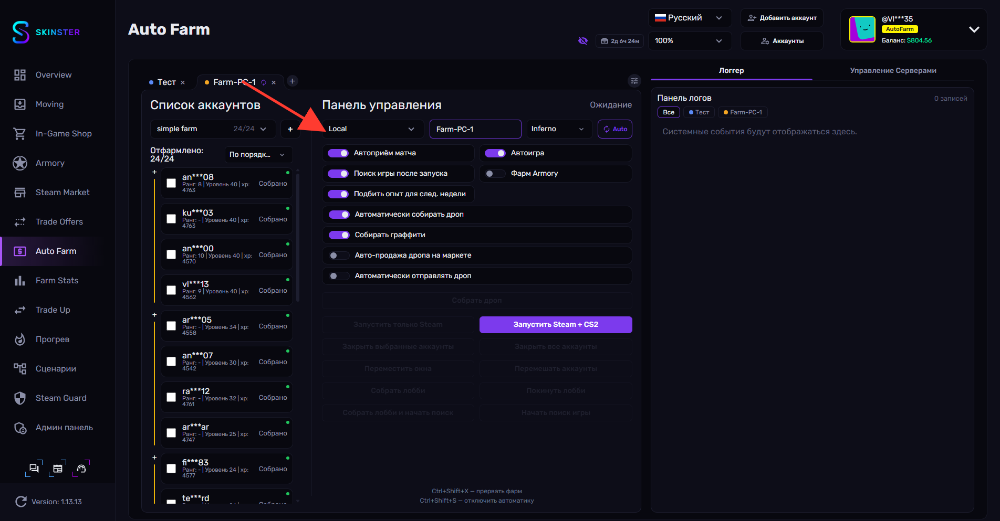<figcaption></figcaption></figure>

| Параметр | Описание | По умолчанию |
| --- | --- | --- |
| **Custom PC Name** (Пользовательское имя ПК) | Имя устройства, которое подставляется в Telegram-уведомления. По умолчанию берётся имя вашего ПК | имя ПК |
| Карта | Карта для матчей: **Inferno**, **Nuke** или **Overpass** | Inferno |

### Расписание (Schedule)

**5.** Кнопка расписания (иконка часов) открывает поповер с двумя режимами автозапуска:

<figure>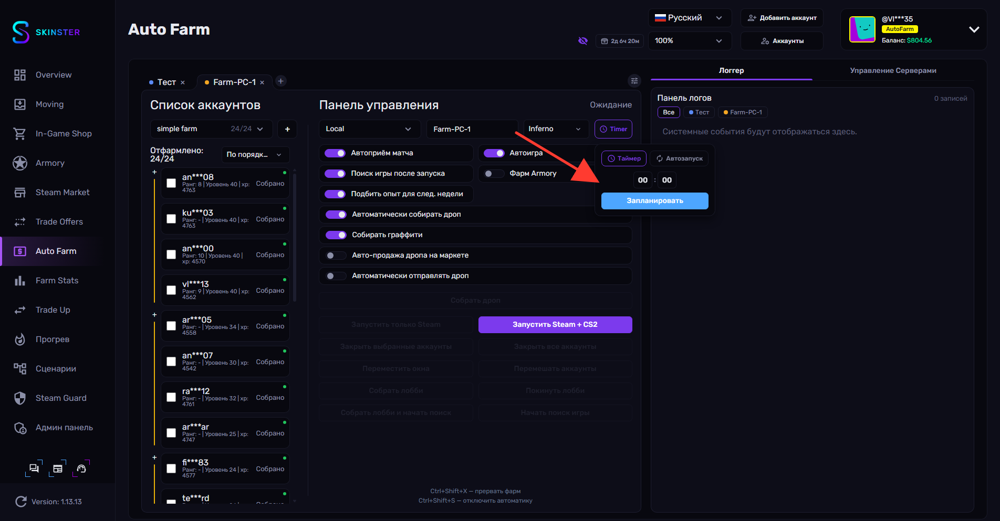<figcaption></figcaption></figure>

* **Таймер** — выбираем время (часы и минуты) и нажимаем **Запланировать**; фарм стартует в указанное время (если время уже прошло — на следующий день). Отменить можно кнопкой **Отменить**.
* **Автозапуск** — фарм будет автоматически стартовать каждую неделю при обновлении еженедельного дропа.

После установки расписания на вкладке появляется иконка-индикатор: часы (таймер) или стрелки (еженедельный автозапуск).

### Настройки только для локального режима

**6.** В режиме **Local** доступны дополнительные тумблеры автоматизации:

<figure><figcaption></figcaption></figure>

| Параметр | Описание |
| --- | --- |
| **Автоприём матча** | Панель сама принимает игру во всех окнах |
| **Автоигра** | Панель забирает управление аккаунтами на себя во время матча |
| **Поиск игры после запуска** | После запуска аккаунтов панель сама соберёт лобби и начнёт поиск |

### Дроп и Armory

Эти настройки определяют, что именно фармить и что делать с наградой.

**Фарм Armory** и **Подбить опыт для след. недели** — взаимоисключающие: включение одного выключает другой.

| Параметр | Описание |
| --- | --- |
| **Фарм Armory** | Вместо еженедельного дропа панель играет матчи 2 на 2, пока не отфармит все звёзды Armory |
| **Подбить опыт для след. недели** | Догоняет опыт, необходимый для дропа на следующей неделе |
| **Автоматически собирать дроп** | После отфарма пачки панель сама выбирает самый дорогой дроп и забирает его |
| **Собирать граффити** | Дополнительно собирает граффити |

**7.** Тумблер **Авто-продажа дропа на маркете** при включении раскрывает настройки автопродажи: **Стратегия цены** и выбор предметов.

<figure>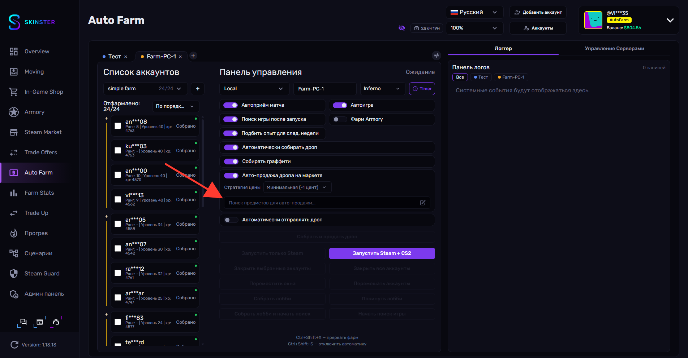<figcaption></figcaption></figure>

| Стратегия цены | Описание |
| --- | --- |
| **Минимальная (-1 цент)** | Выставляет цену на цент ниже минимальной на маркете |
| **Оптимальная** | Сбалансированная цена для быстрой продажи |
| **Подрезка %** | Подрезает цену на заданный процент (поле **%** появляется рядом) |

Через поле **Поиск предметов для авто-продажи...** можно ограничить автопродажу конкретными предметами. Когда автопродажа включена, кнопка сбора дропа меняется на **Собрать и продать дроп**.

**8.** Тумблер **Автоматически отправлять дроп** при включении открывает селектор **Выбрать трейд-ссылки** — указываем, на какой аккаунт (по trade-ссылке) отправлять полученный дроп.

<figure>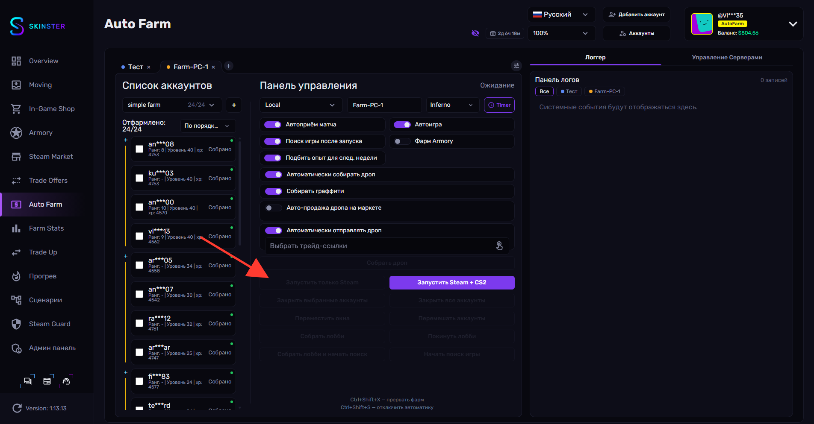<figcaption></figcaption></figure>

Кнопка **Собрать дроп** (или **Собрать и продать дроп**) запускает ручной сбор дропа с выбранных аккаунтов. Во время сбора показывается прогресс и кнопка **Остановить сбор**.

## Настройки фарма

Тумблеры на панели управления (Авто-продажа, Авто-отправка, карта и т.д.) относятся к **конкретной вкладке**. Помимо них есть отдельное окно **Настройки фарма** с расширенными параметрами, которые работают иначе — они **глобальные**: применяются ко **всем вкладкам** и к **обоим режимам** (Local и Background).

**9.** Окно открывается кнопкой-шестерёнкой в правом верхнем углу полосы вкладок (тултип **Дополнительные настройки фарма**).

<figure>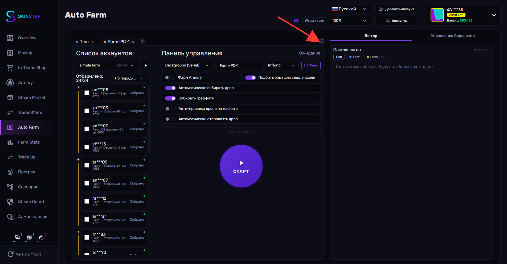<figcaption></figcaption></figure>

Окно **Настройки фарма** разделено на 4 вкладки слева: **Тайминги**, **Производительность**, **Оповещения**, **Дополнительно**. Внизу — кнопки **Сбросить** (сброс настроек текущей вкладки к значениям по умолчанию; неактивна, если уже стоят значения по умолчанию) и **Сохранить** (сохраняет и применяет изменения немедленно; неактивна, если изменений нет или значения некорректны).

### Тайминги

**10.** Параметры времени для всех фарм-сессий.

<figure>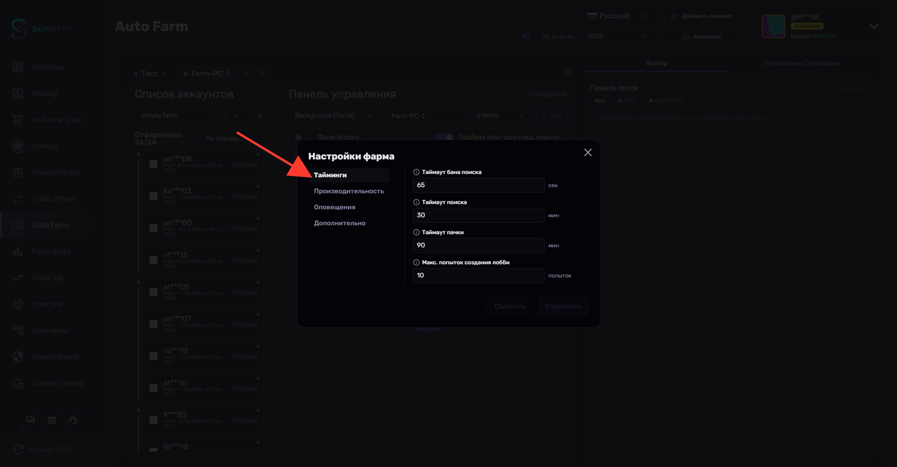<figcaption></figcaption></figure>

| Параметр | Описание | По умолчанию |
| --- | --- | --- |
| **Таймаут бана поиска** | Сколько ждать перед повторным поиском после непринятого матча (лобби получает короткий кулдаун), сек | 65 |
| **Таймаут поиска** | Максимальное время поиска матча до перемешивания аккаунтов, мин | 30 |
| **Таймаут пачки** | Абсолютный лимит времени на пачку (с учётом перемешиваний); после — переход к следующей пачке, мин | 90 |
| **Макс. попыток создания лобби** | Сколько раз пытаться создать лобби до перемешивания | 10 |

### Производительность

**11.** Ограничение нагрузки на процессор.

<figure>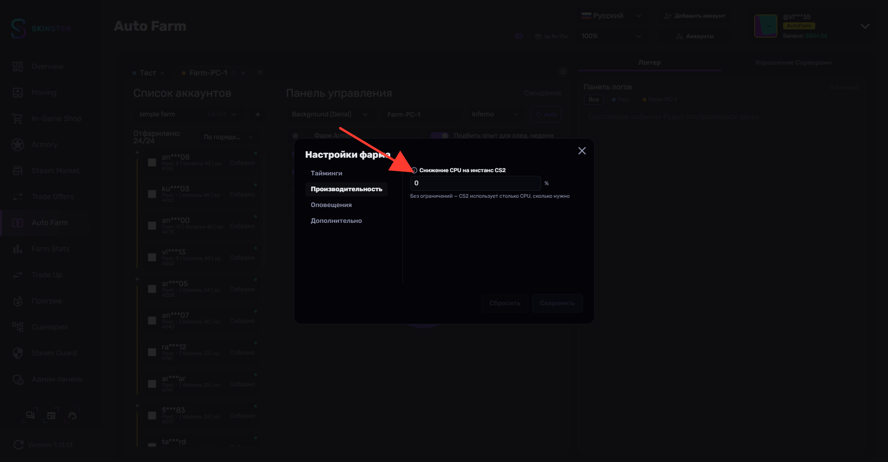<figcaption></figcaption></figure>

| Параметр | Описание | По умолчанию |
| --- | --- | --- |
| **Снижение CPU на инстанс CS2** | Снижает нагрузку CPU для каждого процесса CS2 (метод BES — заморозка циклов потоков). Например, `30` = каждый CS2 получает на 30% меньше процессорного времени. Рекомендуется 5–40% в зависимости от числа инстансов; `0` = без ограничений | 0 |

### Оповещения

**12.** Здесь выбираем, о каких событиях фарма присылать уведомления в Telegram. Сам бот настраивается в **Settings** (см. раздел [Auto Farm](README.md)); здесь — только набор уведомлений. По умолчанию включены все.

<figure>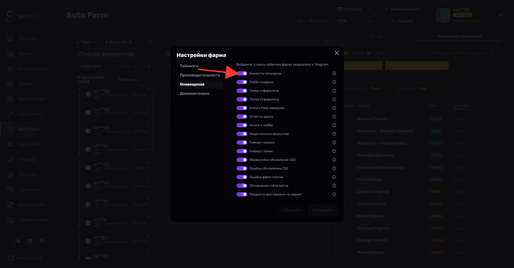<figcaption></figcaption></figure>

| Тумблер | Уведомление |
| --- | --- |
| **Аккаунты запущены** | Аккаунты пачки запущены |
| **Лобби созданы** | Лобби собраны |
| **Пачка отфармлена** | Пачка аккаунтов отфармлена |
| **Папка отфармлена** | Все аккаунты папки отфармлены (с итогами) |
| **Armory Pass завершён** | Завершён фарм Armory Pass |
| **Отчёт по дропу** | Итоговый отчёт по собранному дропу |
| **Не все в лобби** | Не все аккаунты собрались в лобби |
| **Недостаточно аккаунтов** | Недостаточно аккаунтов для старта |
| **Таймаут поиска** | Не удалось найти матч за отведённое время |
| **Таймаут пачки** | Сработал лимит времени на пачку |
| **Обнаружено обновление CS2** | Вышло обновление CS2 |
| **Ошибка обновления CS2** | Не удалось обновить CS2 |
| **Ошибка фарм-сессии** | Не удалось запустить фарм-сессию |
| **Обновления счёта матча** | Старт и завершение матча |
| **Предметы выставлены на маркет** | Предметы выставлены на продажу |

### Дополнительно

**13.** Опции, применяемые после завершения всех фарм-сессий.

<figure>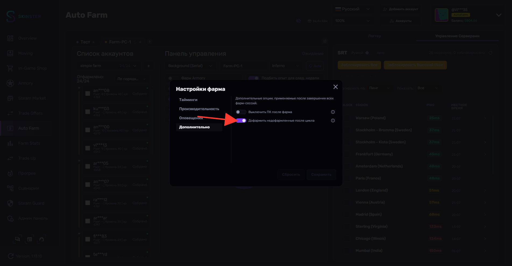<figcaption></figcaption></figure>

| Параметр | Описание | По умолчанию |
| --- | --- | --- |
| **Выключить ПК после фарма** | Автоматически выключает ПК после завершения **всех** фарм-сессий на **всех** вкладках (с отсчётом 10 секунд) | выкл |
| **Дофармить недофармленные после цикла** | После первого полного прохода по очереди папок делает второй проход для папок с недофармленными аккаунтами (подбирает совместимые по рангу ±1 и уровню ±4) | вкл |

## Запуск — локальный режим (Local)

**14.** В режиме **Local** под настройками находится сетка кнопок управления. В состоянии ожидания большинство кнопок неактивны и подсвечиваются по мере запуска фарма.

<figure>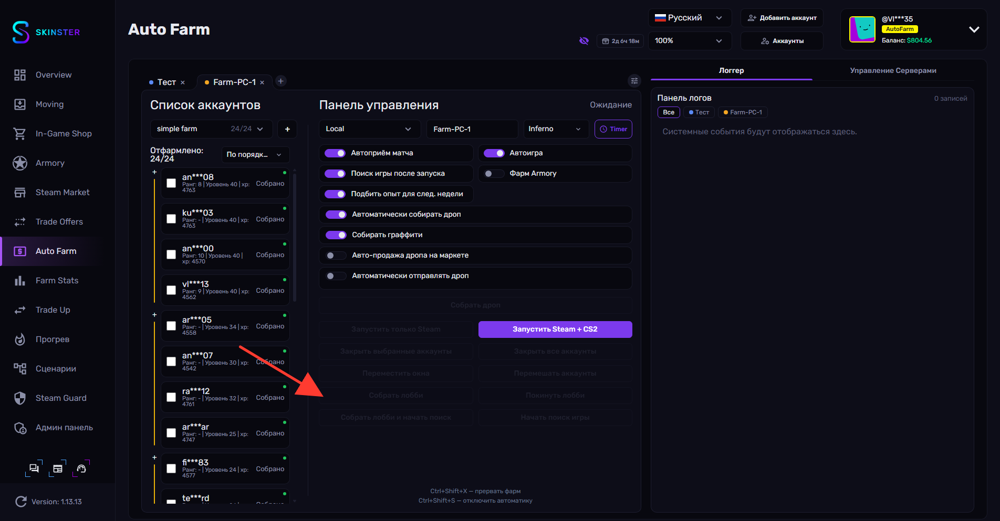<figcaption></figcaption></figure>

Порядок ручного запуска:

* Выбираем папку и пачку аккаунтов (4 шт.).
* Нажимаем **Запустить Steam + CS2** (или **Запустить только Steam**, если нужен только Steam).
* **Переместить окна** — раскладывает окна CS2 по экрану. **Перемешать аккаунты** — меняет позиции окон.
* **Собрать лобби** — собирает аккаунты в одно лобби.
* **Начать поиск игры** или сразу **Собрать лобби и начать поиск** — запускает поиск матча.
* После матча — **Собрать дроп**.

Дополнительные кнопки: **Покинуть лобби**, **Закрыть выбранные аккаунты**, **Закрыть все аккаунты**.


Горячие клавиши локального режима:\
`Ctrl+Shift+X` — прервать фарм\
`Ctrl+Shift+S` — отключить автоматику


## Запуск — фоновый режим (Background Serial)

Фоновый режим работает через **удалённых агентов** — отдельные машины, RDP-сессии или облачные ВМ с установленным агентом Skinster. Игра идёт **не на вашем ПК**, поэтому ваш компьютер остаётся свободным. **Serial** означает «по очереди»: панель берёт пачку (до 4 аккаунтов) и фармит их последовательно, один за другим. Достаточно нажать **Старт** — дальше всё происходит автоматически, без ручного взаимодействия с окнами.


Перед запуском фонового фарма убедитесь, что: есть активная подписка с доступом к Auto Farm; указаны пути к **Steam** и **CS2**; выбрана папка; в папке есть хотя бы один неотфармленный аккаунт (иначе фарм не стартует — «нет доступных неотфармленных аккаунтов»).


**15.** В режиме **Background (Serial)** управление сводится к одной круглой кнопке **Старт**.

<figure>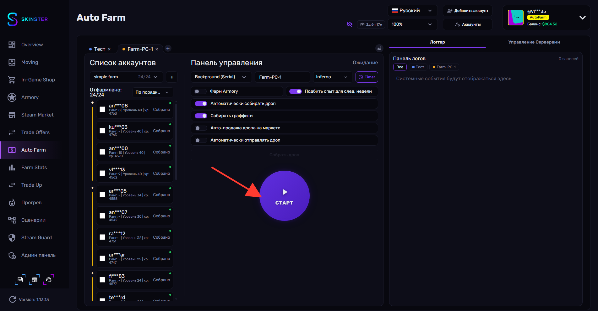<figcaption></figcaption></figure>

Кнопка имеет три состояния: **Старт** (ожидание) → загрузка (спиннер) → активный фарм (красная, остановка). Повторное нажатие в активном состоянии останавливает фарм.

**Правило выбора аккаунтов:** кнопка **Старт** неактивна (серая), если выбрано 1, 2 или 3 аккаунта. Допустимо **0** (панель сама возьмёт до 4 неотфармленных из папки) или **ровно 4**.

**Open Viewer / Close Viewer** (текст в интерфейсе на английском) — кнопка появляется **только когда фарм активен**. Она открывает окно с **живым видеопотоком** экрана/CS2-клиента удалённого агента. Viewer можно открывать и закрывать без перезапуска фарма; при остановке фарма или потере связи он закрывается автоматически.

В фоновом режиме **скрыты** все ручные кнопки локального режима — **Запустить только Steam**, **Запустить Steam + CS2**, **Переместить окна**, **Перемешать аккаунты**, **Собрать лобби**, **Покинуть лобби**, **Собрать лобби и начать поиск**, **Начать поиск игры**, **Закрыть выбранные аккаунты**, **Закрыть все аккаунты** — а также тумблеры **Автоприём матча**, **Автоигра**, **Поиск игры после запуска** и подсказки горячих клавиш.

**Остаются доступными:** выбор режима, **Custom PC Name**, карта, расписание, **Фарм Armory** / **Подбить опыт для след. недели**, **Автоматически собирать дроп**, **Собирать граффити**, **Авто-продажа дропа на маркете**, **Автоматически отправлять дроп**, кнопка **Собрать дроп** и глобальное окно **Настройки фарма**.

## Статусы фарма

Текущий статус показывается в заголовке **Панели управления**. Справочник значений:

| Статус | Значение |
| --- | --- |
| **Ожидание** | Фарм не запущен |
| **Ожидание (Главное меню)** | Аккаунты в главном меню CS2 |
| **Ожидание (В лобби)** | Аккаунты собраны в лобби |
| **Запуск** | Идёт запуск аккаунтов |
| **Создание лобби** | Формируется лобби |
| **Покидание лобби** | Выход из лобби |
| **Поиск игры** | Идёт поиск матча |
| **В игре** | Матч идёт |
| **Steam запущен** | Запущен только Steam (без CS2) |

## SRT (Управление Серверами)

**Server Root Tool (SRT)** блокирует игровые серверы по пингу или региону, чтобы матчи подбирались на удобных серверах. Панель открывается на вкладке **Управление Серверами**.

**16.** В **ручном** режиме доступны кнопки блокировки и фильтры. В шапке показано, сколько всего серверов и сколько заблокировано.

<figure>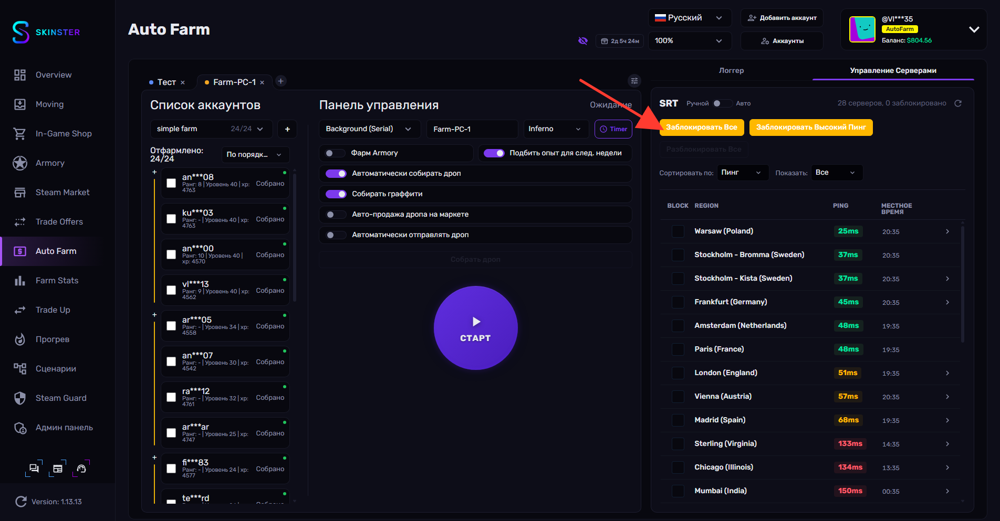<figcaption></figcaption></figure>

| Кнопка | Действие |
| --- | --- |
| **Заблокировать Все** | Блокирует все серверы |
| **Заблокировать Высокий Пинг** | Блокирует серверы с пингом выше порога |
| **Разблокировать Все** | Снимает блокировку со всех серверов |

Фильтры **Сортировать по:** (Пинг / Регион / Статус) и **Показать:** (Все / Заблокированные / Активные) управляют отображением списка. В списке для каждого сервера показаны колонки **Region**, **Ping** и **Местное время**, а слева — чекбокс блокировки.

**17.** Переключатель **Ручной ↔ Авто** включает автоматический режим. В нём панель сама подбирает серверы во время фарма. Поля **Перемешивания**, **Текущий** и **Следующий** заполняются, когда идёт активная фарм-сессия; пока фарм не запущен, отображается **Ожидание запуска фарм-сессии...**.

<figure>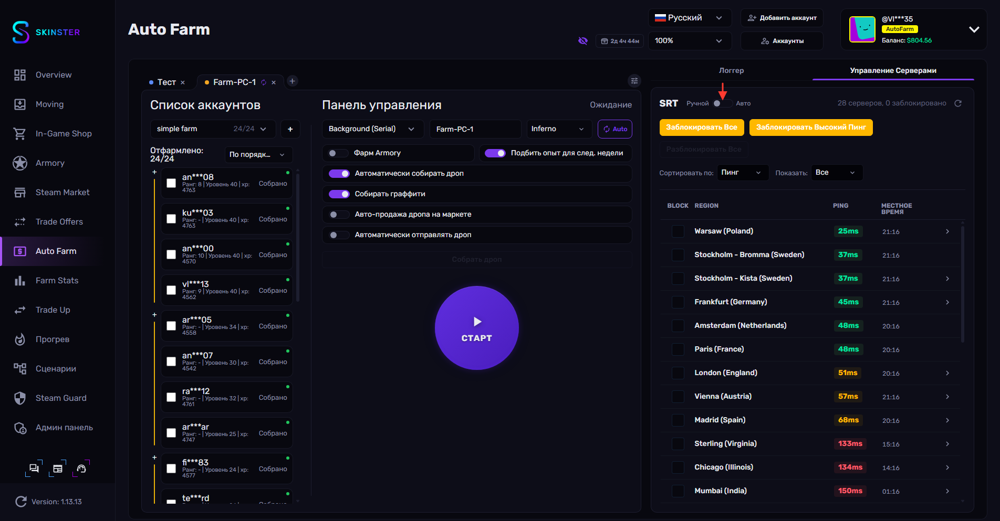<figcaption></figcaption></figure>


Для блокировки и разблокировки серверов нужны права администратора. Если их нет, появится сообщение «Требуются права администратора для блокировки/разблокировки серверов» — перезапустите приложение от имени администратора.


## Логи (Logger)

**18.** На вкладке **Логгер** в реальном времени отображается лог действий фарма. Чипсы-фильтры сверху (**Все** и по вкладкам) позволяют смотреть события отдельной вкладки. Пока фарм не запущен, панель показывает «Системные события будут отображаться здесь.».

<figure>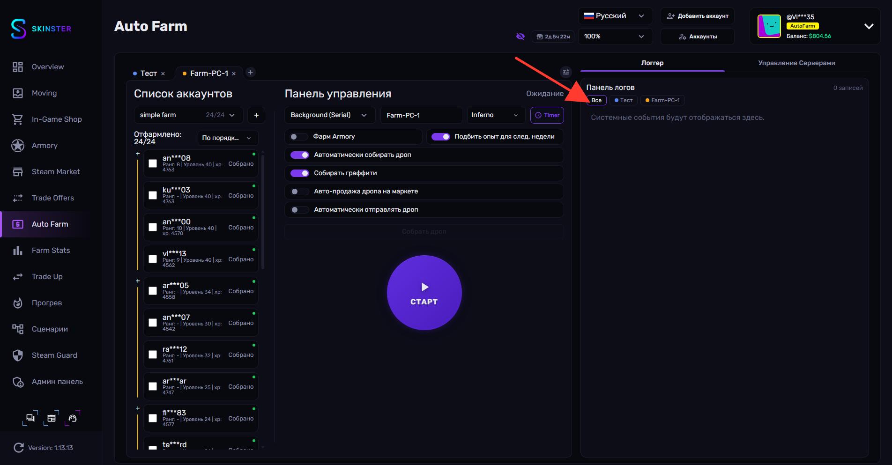<figcaption></figcaption></figure>
