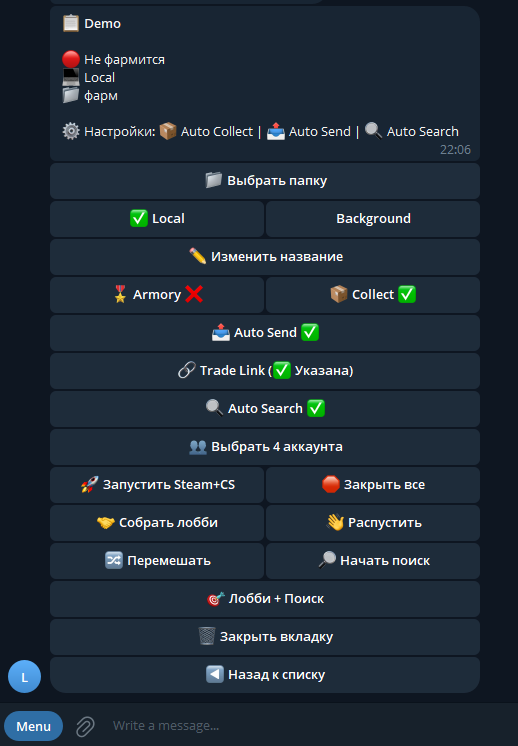
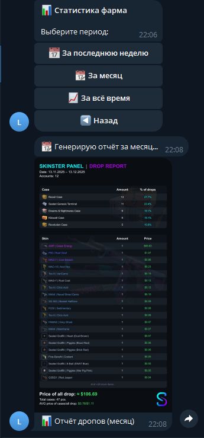

# Уведомление и управление через Telegram

<figure><figcaption></figcaption></figure>

Для получения уведомлений во время фарма необходимо создать своего бота в телеграмм, для этого

1. Открываем @BotFather в телеграмм
2. Запускаем telegram app и нажимаем create bot
3. Придумываем Имя и username
4. Затем выбираем нашего бота и кликаем кнопку copy (токен бота скопирован)
5. Вставляем этот токен в поле №4 (см. скрин вверху)
6. Теперь переходим в @skinster\_bot и в главном меню можно найти свой ID
7. Его необходимо указать в поле №5  (см. скрин вверху)
8. Нажми кнопку Check (Проверить) что бы получить тестовое сообщение
9. Нажимаем кнопку Save (Сохранить)

После выполненых настроек вы будете получать уведомления о состоянии матчей ваших ботов,  а так же управлять фармом и его настройками из телефона

<figure><figcaption></figcaption></figure> <figure><figcaption></figcaption></figure>

