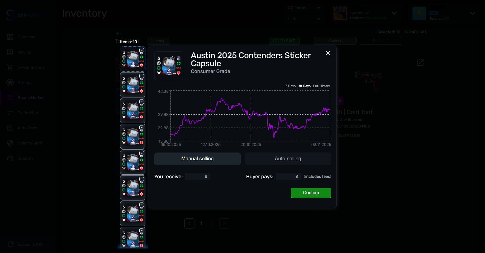

# Steam Market

<figure><figcaption></figcaption></figure>

* Упрощает продажу большого количества однотипных предметов
* Если аккаунт добавлен через maFile автоматически подтвердит его размещение
* Возможно выбрать разного типа предметы и указывать для каждого цену отдельно
* Можно просматривать свои активные ордера на покупку/продажу а так же их отменять
