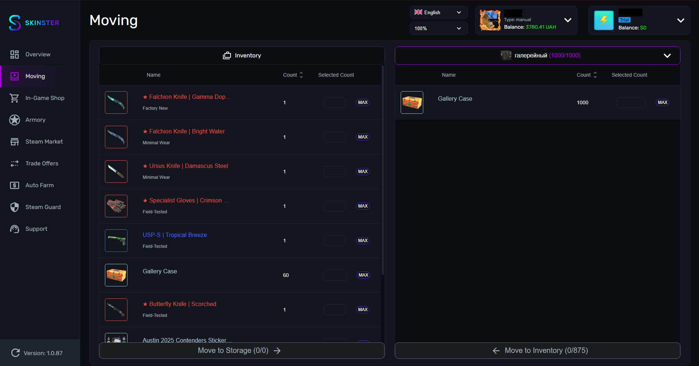

# Moving

<figure><figcaption></figcaption></figure>

* В левой части расположены предметы из вашего инвентаря
* В правой части можно выбрать хранилище, а так же переименовать любое хранилище
* Затем выбрав нужные предметы можно переместить их из инвентаря в хранилище или на оборот
