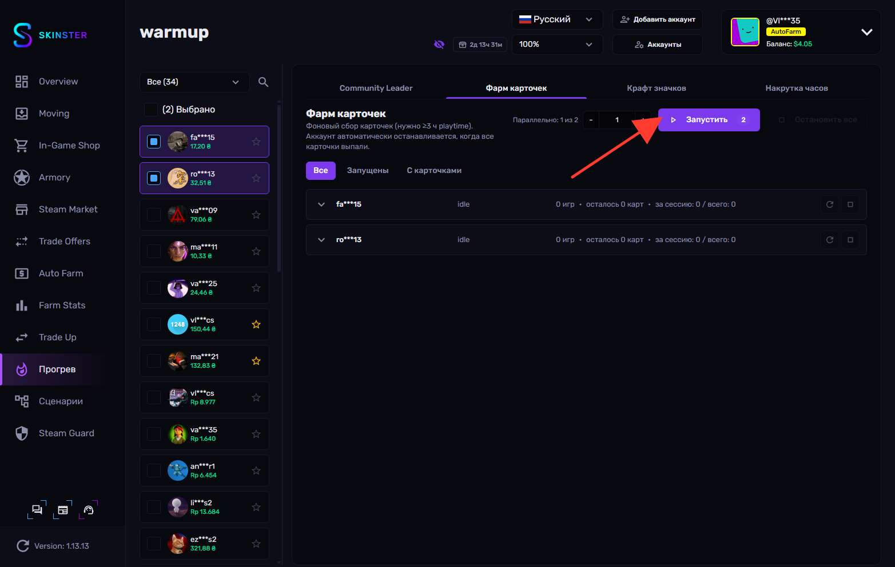
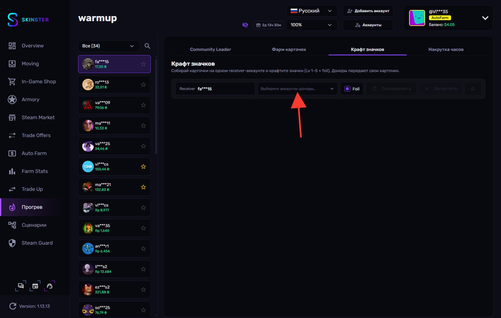
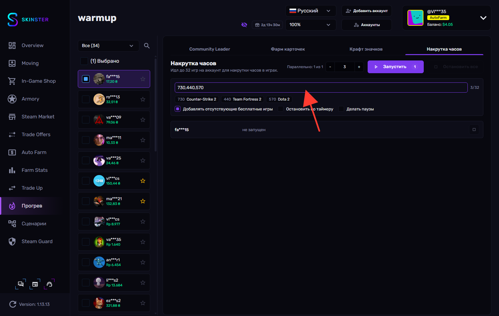

# Warmup

**Warmup** (раздел **Прогрев**) — это набор инструментов для «прогрева» и подготовки аккаунтов: наигрывания часов, сбора и крафта карточек, оформления профиля и прохождения квестов значка **Community Leader**. Всё работает в фоне сразу для нескольких аккаунтов.

Раздел разбит на четыре вкладки:

* **Community Leader** — прогрев профиля (аватар, имя, приватность), наигрывание часов и прохождение квестов значка Community Leader.
* **Фарм карточек** — фоновый сбор торговых карточек на выбранных аккаунтах.
* **Крафт значков** — сбор карточек на один receiver-аккаунт с аккаунтов-доноров и крафт значков (уровни 1–5 + foil).
* **Накрутка часов** — idle до 32 игр на аккаунт для накрутки часов в играх.


Учтите, что **трейды** и **добавление в друзья** создают видимые связи между аккаунтами — Steam может ассоциировать аккаунты, которые обмениваются предметами или состоят в друзьях друг у друга. Как именно такие связи влияют на **распространение банов** между связанными аккаунтами (или, наоборот, на их избежание), достоверно неизвестно. Используйте квесты **Совершить трейд** и **Добавить в друзья** осознанно — особенно если прогреваете аккаунты, которые не хотите связывать между собой.



Большинство действий запускается сразу для нескольких аккаунтов. Параметр **Параллельно** задаёт, сколько аккаунтов обрабатывается одновременно — остальные ждут в очереди и стартуют по мере освобождения слотов.


## Использование

**1.** Переходим в раздел **Прогрев** в боковом меню

<figure><figcaption></figcaption></figure>

**2.** В левой панели отмечаем один или несколько аккаунтов, которые хотим прогреть

<figure><figcaption></figcaption></figure>

**3.** На вкладке **Community Leader** отмечаем нужные квесты, а затем нажимаем **Запустить прогрев**

<figure><figcaption></figcaption></figure>


Часть квестов перед запуском нужно **дополнительно настроить** — для них обязательно заполнить данные, иначе квест будет подсвечен красной рамкой и не выполнится:

* **Добавить в друзья** — выбрать **pair-аккаунт** (с ним подружится прогреваемый аккаунт).
* **Совершить трейд** — выбрать **donor-аккаунт**, который передаст предмет.
* **Скрафтить значки** (в режиме «С аккаунта-донора») — выбрать **donor-аккаунт** и указать **App ID** игры.
* **Установить аватар профиля** (в режиме «Загрузить из локальной папки») — указать **путь к папке** с картинками.

Остальные квесты можно развернуть и настроить по желанию — например, задать свои группы Steam, имена, статусы или App ID игры. Квесты, которые тратят баланс кошелька (покупка карточек на маркете), отмечены предупреждением.


**4.** Чтобы заполнить данные, разворачиваем нужный квест и указываем требуемое значение — например, для квеста **Добавить в друзья** выбираем **pair-аккаунт**

<figure><figcaption></figcaption></figure>

**5.** Для квеста **Совершить трейд** разворачиваем его и в поле **Выбери donor-аккаунт…** выбираем аккаунт, который передаст предмет. Без выбранного donor-аккаунта квест подсвечивается красной рамкой и не выполнится

<figure><figcaption></figcaption></figure>


По умолчанию используется `appId=753` и `contextId=6` (карточки Steam Community). Для CS2-инвентаря укажите `appId=730`, `contextId=2`. Предмет donor-аккаунта реально передаётся — выбирайте инвентарь подешевле.


**6.** Для квеста **Скрафтить значки** разворачиваем его и переключаем режим на **С аккаунта-донора** — тогда появляются два обязательных поля: **Выбрать донор-аккаунт…** и **appId игры (напр. 730)**. Заполняем оба, иначе квест подсвечивается красной рамкой

<figure><figcaption></figcaption></figure>


В режиме **Из инвентаря** дополнительные поля не нужны — аккаунт крафтит значки из карточек, которые уже есть в его инвентаре. Режим **С аккаунта-донора** сначала запрашивает недостающий сет карточек у выбранного donor-аккаунта, поэтому требует указать донора и **App ID** игры.


**7.** На вкладке **Фарм карточек** запускаем фоновый сбор карточек кнопкой **Запустить**

<figure><figcaption></figcaption></figure>


Для выпадения карточек на аккаунте нужно не менее `3 ч` наигранного времени. Аккаунт автоматически останавливается, когда все карточки выпали. Фильтры **Все** / **Запущены** / **С карточками** помогают отслеживать прогресс.


**8.** На вкладке **Крафт значков** выбираем receiver-аккаунт в левой панели, а затем обязательно выбираем **аккаунты-доноры** в поле **Выберите аккаунты-доноры…**

<figure><figcaption></figcaption></figure>


**Receiver** получает карточки и крафтит значки, а **доноры** передают свои карточки через трейд-офферы. Без выбранных доноров кнопка **Сканировать** недоступна. После сканирования выбираем, какие значки крафтить, и запускаем кнопкой **Запустить**.


**9.** На вкладке **Накрутка часов** вводим App ID игр **через запятую** — например `730,440,570` — и нажимаем **Запустить**

<figure><figcaption></figcaption></figure>


Несколько App ID разделяются **запятой** (`730,440,570`). Steam позволяет накручивать часы максимум в `32` играх одновременно. Опции **Остановить по таймеру** и **Делать паузы** позволяют ограничить время сессии и имитировать естественную активность.

