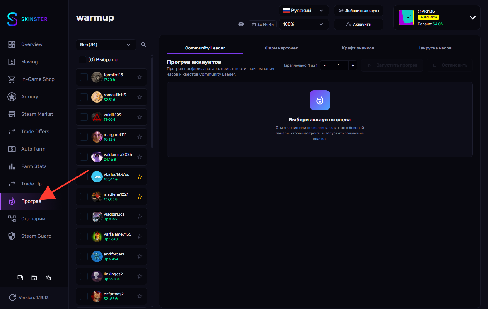
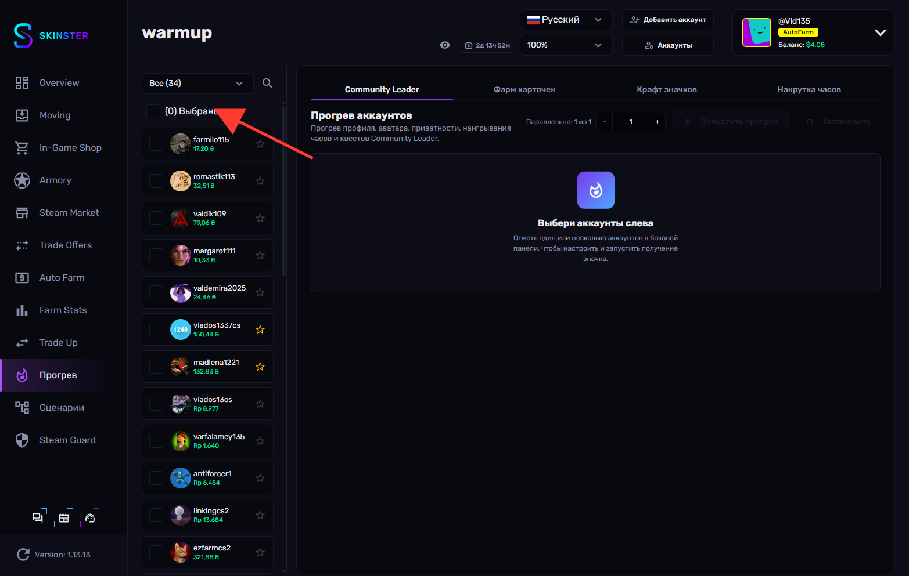
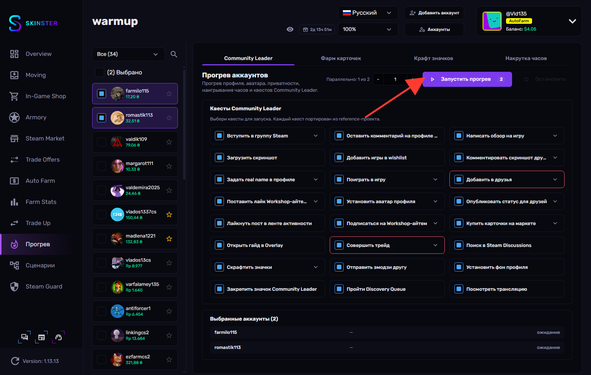
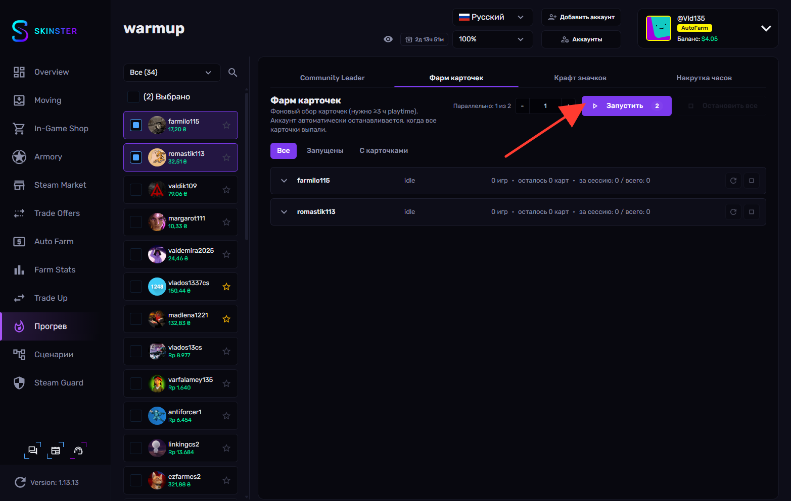
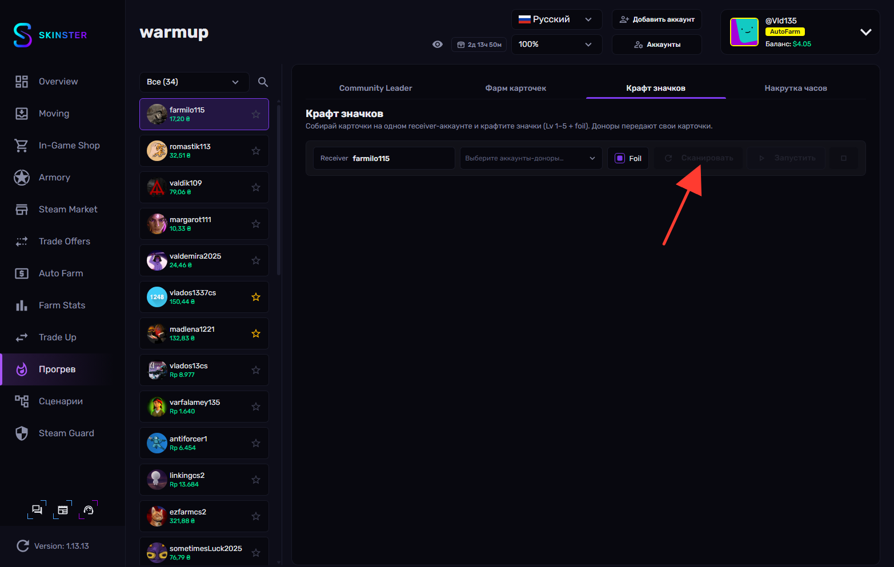

# Warmup

**Warmup** (раздел **Прогрев**) — это набор инструментов для «прогрева» и подготовки аккаунтов: наигрывания часов, сбора и крафта карточек, оформления профиля и прохождения квестов значка **Community Leader**. Всё работает в фоне сразу для нескольких аккаунтов.

Раздел разбит на четыре вкладки:

* **Community Leader** — прогрев профиля (аватар, имя, приватность), наигрывание часов и прохождение квестов значка Community Leader.
* **Фарм карточек** — фоновый сбор торговых карточек на выбранных аккаунтах.
* **Крафт значков** — сбор карточек на один receiver-аккаунт с аккаунтов-доноров и крафт значков (уровни 1–5 + foil).
* **Накрутка часов** — idle до 32 игр на аккаунт для накрутки часов в играх.


Большинство действий запускается сразу для нескольких аккаунтов. Параметр **Параллельно** задаёт, сколько аккаунтов обрабатывается одновременно — остальные ждут в очереди и стартуют по мере освобождения слотов.


## Использование

**1.** Переходим в раздел **Прогрев** в боковом меню

<figure><figcaption></figcaption></figure>

**2.** В левой панели отмечаем один или несколько аккаунтов, которые хотим прогреть

<figure><figcaption></figcaption></figure>

**3.** На вкладке **Community Leader** выбираем нужные квесты и нажимаем **Запустить прогрев**

<figure><figcaption></figcaption></figure>


Каждый квест можно развернуть и настроить дополнительно — например, задать свои группы Steam, аватар, имена или App ID игры. Часть квестов тратит баланс кошелька (покупка карточек на маркете), такие отмечены предупреждением.


**4.** На вкладке **Фарм карточек** запускаем фоновый сбор карточек кнопкой **Запустить**

<figure><figcaption></figcaption></figure>


Для выпадения карточек на аккаунте нужно не менее `3 ч` наигранного времени. Аккаунт автоматически останавливается, когда все карточки выпали. Фильтры **Все** / **Запущены** / **С карточками** помогают отслеживать прогресс.


**5.** На вкладке **Крафт значков** выбираем receiver-аккаунт в левой панели и аккаунты-доноры, затем нажимаем **Сканировать**

<figure><figcaption></figcaption></figure>


**Receiver** получает карточки и крафтит значки, а **доноры** передают свои карточки через трейд-офферы. После сканирования выбираем, какие значки крафтить, и запускаем кнопкой **Запустить**.


**6.** На вкладке **Накрутка часов** вводим App ID игр через пробел или запятую — например `730 440 570` — и нажимаем **Запустить**

<figure><figcaption></figcaption></figure>


Steam позволяет накручивать часы максимум в `32` играх одновременно. Опции **Остановить по таймеру** и **Делать паузы** позволяют ограничить время сессии и имитировать естественную активность.

