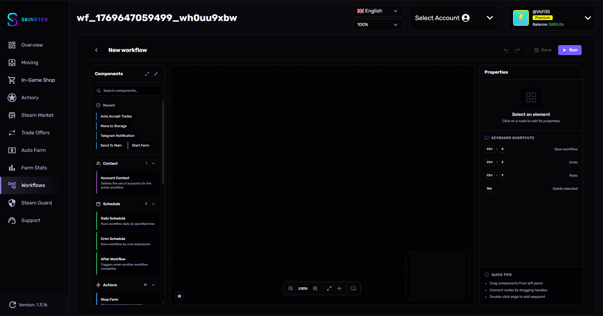

# Workflows

<figure><figcaption></figcaption></figure>


Для использования Workflows необходимо включить **Experimental features** в настройках приложения.


Workflows — это визуальный редактор автоматизации, позволяющий создавать сценарии из нод (блоков). Каждая нода выполняет определённое действие: от выбора аккаунтов до продажи предметов на маркете.

Вы можете соединять ноды между собой, строя цепочки действий, которые будут выполняться автоматически по расписанию или вручную.

## Быстрый старт

1. Откройте раздел **Workflows** в боковом меню
2. Нажмите кнопку создания нового workflow
3. Добавьте **триггер** — определяет когда workflow запустится
4. Добавьте **Account Context** — определяет на каких аккаунтах работать
5. Добавьте нужные **действия** (продажа, покупка, трейд и т.д.)
6. Соедините ноды между собой
7. Сохраните и активируйте workflow

## Категории нод

| Категория | Кол-во | Описание |
|-----------|--------|----------|
| [Расписание и триггеры](raspisanie-i-triggery.md) | 4 | Когда и как запускать workflow |
| [Контекст аккаунтов](kontekst-akkauntov.md) | 1 | На каких аккаунтах выполнять действия |
| [Действия](deistviya.md) | 8 | Основные операции: покупка, продажа, трейд, Armory |
| [Уведомления в Telegram](uvedomleniya-telegram.md) | 2 | Отправка уведомлений и отчётов в Telegram |

## Как работает выполнение

1. **Триггер** запускает workflow (по расписанию, после другого workflow или вручную)
2. **Account Context** загружает список аккаунтов для работы
3. Ноды выполняются **последовательно** по цепочке соединений
4. Каждая нода получает аккаунты из контекста и может фильтровать их
5. **Условия** позволяют создавать ветвления (если да — один путь, если нет — другой)
6. По завершении все сессии аккаунтов автоматически закрываются

Готовые примеры workflow можно найти на странице [Примеры Workflows](primery-workflowov.md).
