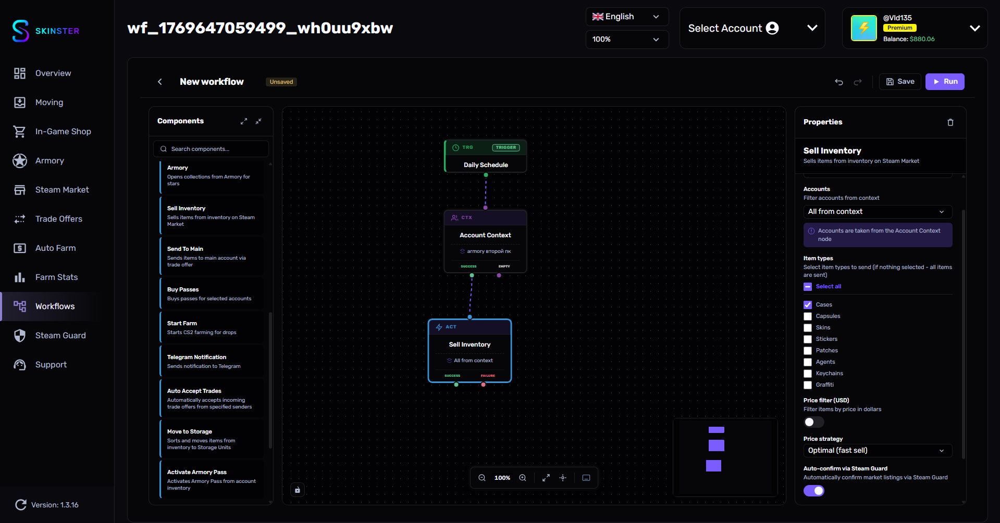

# Действия

<figure><figcaption></figcaption></figure>

Ноды действий — это основные операции, которые workflow выполняет над аккаунтами: покупка пропусков, продажа предметов, покупка на маркете, отправка трейдов и другие.

Все ноды действий имеют параметр **Аккаунты** (`contextFilter`), который позволяет фильтровать аккаунты из контекста: использовать все или только выбранные.

---

## Armory

Открывает коллекции из Armory за звёзды на выбранных аккаунтах.

| Параметр | Описание | Тип | По умолчанию |
|----------|----------|-----|--------------|
| Аккаунты | Фильтрация аккаунтов из контекста | `contextFilter` | Все |
| Коллекция | Выберите коллекцию из Armory | `armoryItemSelector` | — |
| Количество | Сколько раз открыть коллекцию | `select` | Все доступные |
| Количество открытий | Точное количество открытий (от 1) | `number` | 1 |
| Макс. % звёзд | Максимальный процент звёзд для трат (1-100) | `number` | 100 |
| Human-like задержки | Добавлять случайные задержки между операциями | `boolean` | Да |

### Режимы количества

* **Все доступные** — открыть столько раз, сколько хватает звёзд
* **Одно открытие** — открыть коллекцию один раз
* **Указать количество** — указать точное количество открытий
* **Макс. % звёзд** — ограничить траты указанным процентом от общего количества звёзд

### Выходы

| Выход | Когда |
|-------|-------|
| **success** | Коллекции открыты |
| **failure** | Ошибка при открытии |
| **insufficient_stars** | Недостаточно звёзд для открытия |

---

## Buy Passes

Покупает Armory Pass для выбранных аккаунтов.

| Параметр | Описание | Тип | По умолчанию |
|----------|----------|-----|--------------|
| Аккаунты | Фильтрация аккаунтов из контекста | `contextFilter` | Все |
| Режим покупки | Стратегия покупки пропусков | `select` | Докупить до 5 шт |
| Максимум покупок | Лимит покупок за один запуск (1-100) | `number` | 10 |

### Режимы покупки

* **Докупить до 5 шт** — покупает недостающие пропуски по формуле: `5 - активных - в инвентаре`
* **На все деньги** — покупает пропуски пока есть средства на балансе, с ограничением по максимуму покупок


Параметр **Максимум покупок** отображается только при режиме "На все деньги".


Покупка выполняется пачками по 20 пропусков за транзакцию с задержкой 1.5 секунды между пачками.

### Выходы

| Выход | Когда |
|-------|-------|
| **success** | Пропуски куплены |
| **failure** | Ошибка при покупке |

---

## Активация Armory Pass

Активирует Armory Pass из инвентаря аккаунта.

| Параметр | Описание | Тип | По умолчанию |
|----------|----------|-----|--------------|
| Аккаунты | Фильтрация аккаунтов из контекста | `contextFilter` | Все |
| Пропускать если 5 активных | Не активировать если уже есть 5 активных Armory Pass | `boolean` | Да |
| Human-like задержки | Добавлять случайные задержки между операциями | `boolean` | Да |


Если перед этой нодой был выполнен **Buy Passes**, активация автоматически использует купленные пропуски. В противном случае пропуски берутся из инвентаря.


Задержка между активацией предметов: 1.5 секунды. Между аккаунтами: 2.5 секунды.

### Выходы

| Выход | Когда |
|-------|-------|
| **success** | Пропуски активированы |
| **failure** | Ошибка при активации |

---

## Sell Inventory

Продаёт предметы из инвентаря на Steam Market.

| Параметр | Описание | Тип | По умолчанию |
|----------|----------|-----|--------------|
| Аккаунты | Фильтрация аккаунтов из контекста | `contextFilter` | Все |
| Типы предметов | Выберите типы предметов для продажи (если ничего не выбрано — продаются все) | `multiSelect` | — |
| Фильтр по стоимости | Фильтровать предметы по стоимости в долларах | `boolean` | Нет |
| Минимальная стоимость (USD) | Продавать только предметы дороже этой суммы | `number` | 0 |
| Максимальная стоимость (USD) | Не продавать предметы дороже этой суммы | `number` | 999999 |
| Передавать предметы без цены | Включать предметы, у которых ещё нет рыночной цены | `boolean` | Нет |
| Стратегия цены | Как определять цену выставления | `select` | Оптимальная |
| Процент скидки | На сколько процентов снизить цену (0-50) | `number` | 1 |
| Автоподтверждение через Steam Guard | Автоматически подтверждать листинги на маркете | `boolean` | Да |
| Задержка между группами (мс) | Задержка в миллисекундах между обработкой групп предметов (500-10000) | `number` | 1000 |

### Типы предметов

* Кейсы
* Капсулы
* Скины
* Стикеры
* Патчи
* Агенты
* Брелки
* Граффити

Если ни один тип не выбран — продаются все предметы.

### Стратегии цены

* **Оптимальная (быстрая продажа)** — цена рассчитывается для быстрой продажи
* **Самая низкая** — выставление по самой низкой цене на маркете
* **Ниже минимума на %** — цена ниже минимальной на указанный процент (параметр "Процент скидки")

### Выходы

| Выход | Когда |
|-------|-------|
| **success** | Предметы выставлены на продажу |
| **failure** | Ошибка при выставлении |

---

## Buy On Market

Покупает предметы на Steam Market для траты баланса аккаунта. Поддерживает CS2, Dota, Rust, TF2.

| Параметр | Описание | Тип | По умолчанию |
|----------|----------|-----|--------------|
| Аккаунты | Фильтрация аккаунтов из контекста | `contextFilter` | Все |
| Предметы для покупки | Выберите предметы из Steam Market | `marketItemSelector` | — |
| Лимит трат на аккаунт | Как ограничить траты на каждый аккаунт | `select` | % от баланса |
| Процент от баланса | Процент баланса для трат (1-100) | `number` | 90 |
| Сумма | Фиксированная сумма в валюте аккаунта | `number` | 1.00 |
| Макс. предметов | Максимальное количество предметов на аккаунт (1-1000) | `number` | 10 |
| Задержка между покупками (мс) | Задержка между каждым запросом на покупку (1000-30000) | `number` | 3000 |
| Задержка между аккаунтами (мс) | Задержка между обработкой аккаунтов (2000-60000) | `number` | 5000 |

### Лимит трат

* **% от баланса** — потратить указанный процент от баланса аккаунта (по умолчанию 90%)
* **Фиксированная сумма** — потратить фиксированную сумму в валюте аккаунта
* **Количество предметов** — ограничить по количеству купленных предметов
* **Весь баланс** — потратить весь доступный баланс

### Как это работает

1. Для каждого аккаунта создаётся сессия и определяется баланс
2. Автоматически генерируется биллинг-информация, соответствующая региону аккаунта
3. Загружаются актуальные цены выбранных предметов с маркета
4. Предметы покупаются последовательно с учётом лимита трат
5. При необходимости подтверждение покупки выполняется автоматически через Steam Guard


Нода автоматически обрабатывает ограничения Steam (rate limiting) — при блокировке делает паузу 30 секунд и повторяет попытку.


### Выходы

| Выход | Когда |
|-------|-------|
| **success** | Хотя бы один предмет куплен |
| **failure** | Ни одного предмета не куплено или произошла ошибка |

---

## Send To Main

Отправляет предметы на указанный аккаунт через trade offer.

| Параметр | Описание | Тип | По умолчанию |
|----------|----------|-----|--------------|
| Аккаунты | Фильтрация аккаунтов из контекста (источники) | `contextFilter` | Все |
| Трейд-ссылка получателя | Выберите или введите трейд-ссылку целевого аккаунта | `tradeLinkSelector` | — |
| Типы предметов | Выберите типы предметов для отправки (если ничего не выбрано — отправляются все) | `multiSelect` | — |
| Фильтр по стоимости | Фильтровать предметы по стоимости в долларах | `boolean` | Нет |
| Минимальная стоимость (USD) | Отправлять только предметы дороже этой суммы | `number` | 0 |
| Максимальная стоимость (USD) | Не отправлять предметы дороже этой суммы | `number` | 999999 |
| Передавать предметы без цены | Включать предметы, у которых ещё нет рыночной цены | `boolean` | Нет |
| Автоподтверждение через Steam Guard | Автоматически подтверждать исходящие трейды (только MaFiles) | `boolean` | Да |


Автоподтверждение через Steam Guard работает только с MaFiles.


Отправляются только предметы, доступные для обмена (проверяется `trade_unlock`).

### Выходы

| Выход | Когда |
|-------|-------|
| **success** | Трейды отправлены |
| **failure** | Ошибка при отправке |

---

## Перемещение в хранилище

Сортирует и перемещает предметы из инвентаря в Storage Units.

| Параметр | Описание | Тип | По умолчанию |
|----------|----------|-----|--------------|
| Аккаунты | Фильтрация аккаунтов из контекста | `contextFilter` | Все |
| Конфигурация хранилищ | Настройка распределения предметов по Storage Units для каждого аккаунта | `accountStorageConfig` | — |

Настройка распределения выполняется индивидуально для каждого аккаунта через интерфейс конфигурации хранилищ.

### Выходы

| Выход | Когда |
|-------|-------|
| **success** | Предметы перемещены |
| **failure** | Ошибка при перемещении |

---

## Авто-принятие трейдов

Автоматически принимает входящие трейд-офферы от указанных отправителей.

| Параметр | Описание | Тип | По умолчанию |
|----------|----------|-----|--------------|
| Аккаунты | Фильтрация аккаунтов из контекста | `contextFilter` | Все |
| Принимать от | От кого принимать трейд-офферы | `select` | Все аккаунты в базе |
| Отправители | Выберите аккаунты, от которых принимать трейды | `accountSelector` | — |
| Только подарки | Принимать только офферы без обмена (подарки) | `boolean` | Нет |
| Автоподтверждение Steam Guard | Автоматически подтверждать принятые трейды через мобильный аутентификатор | `boolean` | Да |
| Время ожидания (сек) | Сколько секунд ждать входящие трейды (10-600) | `number` | 60 |
| Интервал проверки (сек) | Как часто проверять новые трейды (5-60) | `number` | 10 |

### Режимы приёма

* **Все аккаунты в базе** — принимать трейды от любого аккаунта, добавленного в Skinster
* **Только выбранные** — принимать только от указанных аккаунтов (появляется поле "Отправители")
* **Любые отправители** — принимать трейды от кого угодно


Режим "Любые отправители" принимает трейды от всех, включая незнакомых. Используйте с осторожностью.


Нода проверяет наличие входящих трейдов каждые N секунд (интервал проверки) в течение указанного времени ожидания.

### Выходы

| Выход | Когда |
|-------|-------|
| **success** | Трейды приняты |
| **failure** | Ошибка при приёме |
| **no_trades** | За время ожидания не поступило ни одного трейда |
