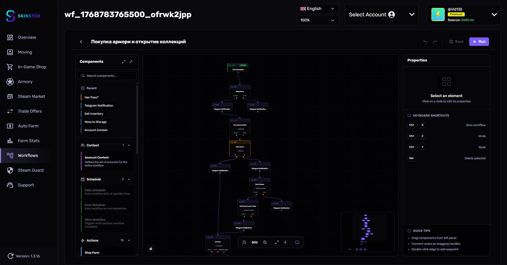

# Примеры Workflows

<figure><figcaption></figcaption></figure>

Здесь собраны готовые примеры workflow для типичных сценариев использования. Каждый пример содержит цепочку нод и рекомендуемые настройки параметров.

---

## Пример 1: Цикл армори

Полный замкнутый цикл работы с Armory: продажа инвентаря, покупка и активация пропусков при необходимости, открытие коллекции, фарм звёзд и возврат к началу. Запускается вручную и работает до остановки.


armory-cycle.json — готовый workflow для импорта



После импорта обязательно подправьте **3 поля** под себя (см. раздел "Что настроить под себя" ниже).


### Цепочка нод

```
Manual Start → Account Context → Sell Inventory → Delay (3 мин) → Has Pass?
  ├─ yes → Armory ──────────────────────────────────┐
  └─ no  → Buy Passes → Activate Armory Pass → Armory
                                                    ↓
                                            Summary Report → Has Pass?
                                                              ├─ yes → Start Farm
                                                              │          ├─ success → (обратно к Sell Inventory)
                                                              │          └─ failure → Telegram "фарм упал"
                                                              └─ no  → Telegram "Нечего фармить"
```

Ключевая особенность — **обратное ребро** от `Start Farm (success)` к `Sell Inventory`: после успешного фарма цикл начинается заново.

### Настройки нод

**Manual Start:** без параметров — запуск вручную с кнопки.

**Account Context:**
* Источник: `Папка`
* Папка: **выберите свою папку с аккаунтами**

**Sell Inventory:**
* Фильтр предметов: `Все предметы`
* Фильтр по стоимости: `Нет`
* Стратегия цены: `Оптимальная`
* Автоподтверждение: `Да`
* Задержка между группами: `1000 мс`

**Delay:**
* Тип: `Фиксированная`
* Длительность: `180 секунд` (3 минуты — даёт маркету время обработать выставление лотов)

**Has Pass? (перед Armory):**
* Мин. кол-во активных: `1`
* Условие: `Хотя бы у одного аккаунта`

**Buy Passes:**
* Режим покупки: `Докупить до 5 шт`
* Максимум покупок: `10`

**Activate Armory Pass:**
* Пропускать если 5 активных: `Да`
* Human-like задержки: `Да`

**Armory:**
* Коллекция: **выберите свою коллекцию**
* Количество: `Все доступные`
* Макс. % звёзд: `100`
* Human-like задержки: `Да`

**Summary Report:**
* Секции: все (баланс, продажи, отправки, трейды, хранилища, пропуски, фарм, Armory, ордера)

**Has Pass? (перед фармом):**
* Мин. кол-во активных: `1`
* Условие: `Хотя бы у одного аккаунта`

**Start Farm:**
* Режим выполнения: `В фоне (RDP)`
* Тип фарма: `Armory`
* Папка: **та же, что в Account Context**
* Порядок аккаунтов: `По папке`
* Фармить до %: `100`
* Ждать завершения: `Да`
* Human-like задержки: `Да`

**Telegram Notification (при успехе фарма не вызывается — ветка идёт в цикл):**
* Тип: `Своё сообщение`
* При падении фарма: `фарм упал: {{workflowName}}`
* При отсутствии пропусков: `Нечего фармить\nВозможно не хватило баланса на новые пропуски`

### Что настроить под себя

После импорта workflow обязательно проверьте и поменяйте эти поля:

| Нода | Что изменить |
|------|---------------|
| **Account Context** | Выбрать папку аккаунтов (Необходимо для продажи и покупки) |
| **Armory** | Указать коллекцию для открытия (В примере используется Fever) |
| **Start Farm** | Выбрать ту же папка, что в Account Context |


---

## Пример 2: Рандомная рассылка предметов

Позволяет отправить предметы с большого количества аккаунтов-отправителей на несколько аккаунтов-получателей в случайном порядке. Например, раздать дроп со 100 фарм-аккаунтов на 10 основных — каждый предмет уйдёт на случайного получателя из списка.


random-trades.json — готовый workflow для импорта



После импорта обязательно подправьте **2 поля** под себя (см. раздел "Что настроить под себя" ниже).


### Цепочка нод

```
Manual Start → Account Context → Send To Main
                                    ├─ success → Summary Report
                                    └─ failure → Telegram уведомление → Summary Report
```

### Настройки нод

**Manual Start:** без параметров — запуск вручную.

**Account Context:**
* Источник: `Выбранные вручную`
* Аккаунты: **выберите аккаунты-отправители** (с которых будут уходить предметы)

**Send To Main:**
* Трейд-ссылки получателей: **добавьте список трейд-ссылок** — например, 10 основных аккаунтов. Распределение предметов по ссылкам происходит случайным образом
* Фильтр предметов: `Все предметы`
* Фильтр по стоимости: `Да`
* Минимальная стоимость: `$0`
* Максимальная стоимость: `$99999` (чтобы не отправить дорогие предметы — настройте под свои нужды)
* Передавать предметы без цены: `Нет`
* Автоподтверждение через Steam Guard: `Да`

**Summary Report:**
* Секции: все (баланс, продажи, отправки, трейды, хранилища, пропуски, фарм, Armory, ордера)

**Telegram уведомление (на failure):**
* Тип: `Своё сообщение`
* Сообщение: `Не удалось отправить трейды`

### Что настроить под себя

После импорта workflow обязательно проверьте и поменяйте эти поля:

| Нода | Что изменить |
|------|---------------|
| **Account Context** | Выбрать аккаунты-отправители (те, с которых уходят предметы) |
| **Send To Main** | Добавить трейд-ссылки получателей — предметы распределятся по ним случайно |


---

## Пример 3: Автосортировка инвентаря

Регулярная сортировка предметов по хранилищам (Storage Units).

### Цепочка нод

```
Cron Schedule → Account Context → Move To Storage → Telegram уведомление
```

### Настройки

**Cron Schedule:**
* Cron выражение: `0 10,22 * * *` (в 10:00 и 22:00)
* Часовой пояс: `Киев (UTC+2)`

**Account Context:**
* Источник: `Все аккаунты`

**Move To Storage:**
* Настройте распределение по хранилищам для каждого аккаунта

**Telegram уведомление:**
* Тип: `Своё сообщение`
* Сообщение: `Сортировка завершена! Обработано {{accountsCount}} аккаунтов.`

---

## Советы

* **Используйте задержки** — добавляйте ноду Delay между действиями, особенно если workflow выполняет много операций подряд
* **Включайте Human-like задержки** — опция доступна в нодах фарма, Armory и активации пропусков. Добавляет случайные задержки для имитации естественного поведения
* **Тестируйте на одном аккаунте** — перед запуском workflow на всех аккаунтах, протестируйте его на одном. Используйте режим "Выбранные вручную" в Account Context
* **Используйте цепочки** — для сложных сценариев разбивайте логику на несколько workflow и связывайте их через триггер "После Workflow"
* **Настройте уведомления** — добавляйте ноду Telegram уведомления в конце каждого workflow, чтобы отслеживать результаты
