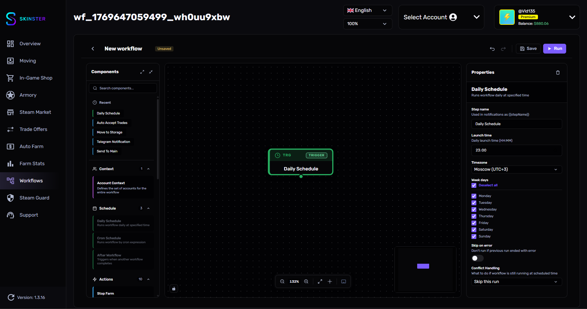

# Расписание и триггеры

<figure><figcaption></figcaption></figure>

Триггеры — это стартовые ноды workflow. Каждый workflow должен начинаться с одного триггера, который определяет когда и как он будет запущен.

## Daily Schedule

Запускает workflow ежедневно в указанное время.

| Параметр | Описание | Тип | По умолчанию |
|----------|----------|-----|--------------|
| Время запуска | Время ежедневного запуска (HH:MM) | `time` | 23:00 |
| Часовой пояс | Часовой пояс для времени запуска | `select` | Киев (UTC+2) |
| Дни недели | В какие дни запускать workflow | `multiSelect` | Все дни |
| Пропускать при ошибке | Не запускать если предыдущий запуск завершился с ошибкой | `boolean` | Нет |
| Обработка конфликтов | Что делать если предыдущий запуск ещё активен | `select` | Пропустить |
| Задержка после завершения | Сколько минут ждать после завершения (5-1440) | `number` | 60 мин |

### Часовые пояса

* Киев (UTC+2)
* Лондон (UTC+0)
* Нью-Йорк (UTC-5)
* Токио (UTC+9)

### Обработка конфликтов

Определяет поведение если предыдущий запуск ещё не завершён:

* **Пропустить этот запуск** — текущий запуск будет пропущен
* **Поставить в очередь** — запуск будет ожидать завершения текущего
* **Прервать текущий и запустить новый** — текущий запуск будет остановлен
* **Запустить после завершения** — новый запуск начнётся после завершения текущего, с указанной задержкой

### Пример использования

Запуск фарма каждый день в 23:00 по Киеву, по будням:
* Время запуска: `23:00`
* Часовой пояс: `Киев (UTC+2)`
* Дни недели: Пн, Вт, Ср, Чт, Пт
* Обработка конфликтов: `Пропустить этот запуск`

---

## Cron Schedule

Запускает workflow по cron-выражению. Подходит для более гибкой настройки расписания.

| Параметр | Описание | Тип | По умолчанию |
|----------|----------|-----|--------------|
| Cron выражение | Расписание в формате cron | `cronBuilder` | 0 23 * * * |
| Часовой пояс | Часовой пояс для расписания | `select` | Киев (UTC+2) |
| Пропускать при ошибке | Не запускать если предыдущий запуск завершился с ошибкой | `boolean` | Нет |

### Готовые пресеты

| Пресет | Cron выражение | Описание |
|--------|---------------|----------|
| Каждый день в 23:00 | `0 23 * * *` | Стандартный ежедневный запуск |
| Каждые 6 часов | `0 */6 * * *` | 4 раза в сутки |
| По будням в 22:00 | `0 22 * * 1-5` | Только рабочие дни |
| Каждый понедельник в 12:00 | `0 12 * * 1` | Раз в неделю |
| Каждые 30 минут | `*/30 * * * *` | Частый запуск |
| Первого числа месяца | `0 0 1 * *` | Раз в месяц |
| Каждое воскресенье в полночь | `0 0 * * 0` | Раз в неделю |
| В 10:00, 14:00 и 18:00 | `0 10,14,18 * * *` | 3 раза в день |

### Формат cron

Cron-выражение состоит из 5 полей:

```
минуты  часы  день_месяца  месяц  день_недели
  0      23      *           *        *
```

| Поле | Диапазон | Спецсимволы |
|------|----------|-------------|
| Минуты | 0-59 | `*` `,` `-` `/` |
| Часы | 0-23 | `*` `,` `-` `/` |
| День месяца | 1-31 | `*` `,` `-` `/` |
| Месяц | 1-12 | `*` `,` `-` `/` |
| День недели | 0-7 (0 и 7 = Вс) | `*` `,` `-` `/` |

* `*` — любое значение
* `,` — список (1,3,5)
* `-` — диапазон (1-5)
* `/` — шаг (*/6 = каждые 6)

---

## После Workflow

Запускает workflow после завершения другого workflow. Позволяет выстраивать цепочки автоматизации.

| Параметр | Описание | Тип | По умолчанию |
|----------|----------|-----|--------------|
| Исходный Workflow | Workflow, после завершения которого запустится этот | `workflowSelector` | — (обязательно) |
| Условие запуска | Когда запускать этот workflow | `select` | Только при успехе |
| Задержка запуска (сек) | Время ожидания перед запуском (0-3600) | `number` | 10 сек |

### Условия запуска

* **Только при успехе** — запуск только если исходный workflow завершился без ошибок
* **Только при ошибке** — запуск только если исходный workflow завершился с ошибкой
* **При любом результате** — запуск в любом случае

### Пример использования

Цепочка: сначала фарм, затем продажа:
* **Workflow A**: Daily Schedule → Account Context → Start Farm
* **Workflow B**: После Workflow (Workflow A) → Account Context → Sell Inventory → Notification
* Условие запуска: `Только при успехе`
* Задержка: `30 секунд`
