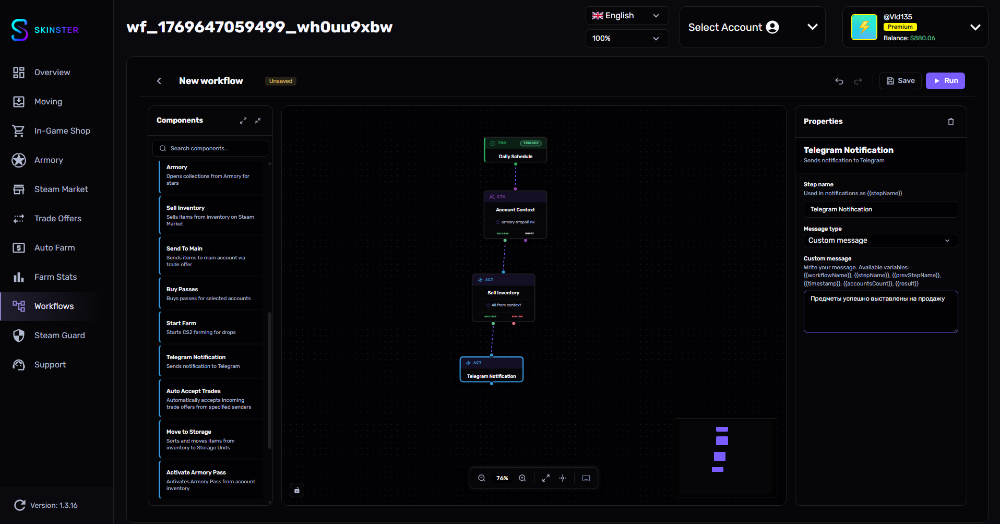

# Уведомления в Telegram

<figure><figcaption></figcaption></figure>

Нода **Telegram уведомление** отправляет сообщение в Telegram в любой точке workflow. Используйте её для уведомлений о завершении, ошибках или промежуточных результатах.


Для работы уведомлений необходимо настроить Telegram-бота в настройках приложения. Подробная инструкция по настройке описана на странице [Уведомление и управление через Telegram](../auto-farm/uvedomlenie-i-upravlenie-cherez-telegram.md).


## Параметры

| Параметр | Описание | Тип | По умолчанию |
|----------|----------|-----|--------------|
| Тип сообщения | Выбор между шаблоном и своим сообщением | `select` | Шаблон |
| Шаблон | Готовый шаблон сообщения | `select` | Workflow завершён |
| Своё сообщение | Произвольный текст с поддержкой переменных | `textarea` | — |

## Шаблоны сообщений

### Workflow завершён

Отправляет сообщение о завершении workflow:

```
Workflow "{{workflowName}}" завершён

Обработано: {{accountsCount}} аккаунтов
Результат: {{result}}
```

### Шаг выполнен

Отправляет сообщение о завершении конкретного шага:

```
{{stepName}} выполнен

Workflow: {{workflowName}}
Время: {{timestamp}}
```

### Уведомление об ошибке

Отправляет сообщение при возникновении ошибки:

```
Ошибка в "{{workflowName}}"

Шаг: {{stepName}}
Проверьте логи для деталей.
```

## Своё сообщение

Выберите тип "Своё сообщение" для написания произвольного текста. В тексте можно использовать переменные, которые автоматически подставляются при отправке.

## Доступные переменные

| Переменная | Описание |
|-----------|----------|
| `{{workflowName}}` | Название текущего workflow |
| `{{stepName}}` | Название текущей ноды |
| `{{prevStepName}}` | Название предыдущей ноды |
| `{{timestamp}}` | Время выполнения |
| `{{accountsCount}}` | Количество аккаунтов в контексте |
| `{{result}}` | Результат предыдущего шага |

### Пример своего сообщения

```
Фарм завершён!

Workflow: {{workflowName}}
Аккаунтов: {{accountsCount}}
Предыдущий шаг: {{prevStepName}}
Время: {{timestamp}}
```

## Выходы

| Выход | Когда |
|-------|-------|
| **output** | Сообщение отправлено (или попытка отправки) |


Нода уведомления имеет только один выход — workflow продолжит выполнение вне зависимости от результата отправки.

