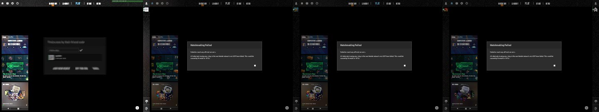

# Решение популярных проблем

Часто встречающиеся проблемы и их решения при использовании Skinster.

## Фоновый режим фарма не запускается



Если фоновый режим фарма не запускается, необходимо обновить конфигурацию RDP Wrapper.

**Скачайте утилиту:** [rdpwrap-offset-finder.exe](https://github.com/Vld135/skinster/releases/download/rdpwrap-offset-finder-v1.0/rdpwrap-offset-finder.exe)

**Инструкция:**

1. Перейдите в **Настройки** Skinster и отключите **автообновление rdpwrap.ini**
2. Запустите скачанный `rdpwrap-offset-finder.exe` от имени администратора
3. Выберите опцию **1** — сканирование системного DLL и сбор необходимых данных
4. Выберите опцию **4** — обновление `rdpwrap.ini`
5. Выберите опцию **8** — перезапуск сервиса

После выполнения этих шагов фоновый фарм должен заработать.



При запуске фоновой сессии может появиться экран с предложением обновиться до Windows 11. Это окно блокирует запуск фарма и его необходимо закрыть вручную.

**Инструкция:**

1. Нажмите `Win+L` для перехода на экран выбора пользователя
2. Выберите пользователя `skinster_bot_1` или `skinster_bot_2`
3. Введите пароль `Test@1234`
4. Откажитесь от перехода на Windows 11
5. Выполните перезагрузку пк

После этого фоновый фарм должен заработать.



## Панель вводит неверный Steam Guard код

Если вы заметили, что панель вводит неверный Steam Guard код при запуске аккаунтов:

**Как определить проблему:**

1. **Локальный режим** — проблема видна сразу, так как авторизация происходит на главном экране
2. **Фоновый фарм** — в логах будет видно, что панель пытается запустить один и тот же аккаунт несколько раз безуспешно. Для подтверждения начните запуск фарма и через Telegram-бота запросите несколько скриншотов с интервалом в пару секунд — на них можно будет увидеть, что проблема именно в авторизации

**Решение:**

1. Перейдите в **Настройки Дата и время**
2. Выключите опцию **«Устанавливать время автоматически»**
3. Включите её обратно
4. Повторите эти шаги для каждого пользователя системы (`skinster_bot_1`, `skinster_bot_2` и т.д.) — пароль `Test@1234`

## Проблема со сбором дропа

Если вы используете прокси, подключённые к папке, потенциально проблема может быть в них. Попробуйте отключить использование прокси для сбора дропа.

**Решение:**

1. Перейдите на страницу **Accounts** в раздел **Прокси**
2. Нажмите кнопку настроек
3. Отключите использование прокси для сбора дропа

## Боты не могут начать поиск матча (ошибка SRT)

<figure><figcaption></figcaption></figure>

Возможно, во время переключения между режимами SRT что-то пошло не по плану, и в системе остались включены правила файрвола одновременно для авто и ручного режима.

**Диагностика:**

1. Через меню поиска Windows найдите **PowerShell** и запустите его **от имени администратора**
2. Выполните по очереди:

```powershell
Get-NetFirewallRule -DisplayName 'CS2_SRT_Block*' | Select DisplayName, Enabled, Direction | Format-Table
```

```powershell
Get-NetFirewallRule -DisplayName 'CS2_SRT_Auto*' | Select DisplayName, Enabled, Direction | Format-Table
```

Если обе команды выводят правила — необходимо их удалить.

**Решение:**

1. Откройте **SRT** в панели, перейдите в режим **Manual** и убедитесь, что все серверы включены (сбрасываем всё по умолчанию)
2. В **PowerShell (от имени администратора)** выполните по очереди:

```powershell
Get-NetFirewallRule -DisplayName 'CS2_SRT_Block*' | Remove-NetFirewallRule -Confirm:$false
```

```powershell
Get-NetFirewallRule -DisplayName 'CS2_SRT_Auto*' | Remove-NetFirewallRule -Confirm:$false
```

После этого поиск матча должен заработать.


Если проблема сохраняется после выполнения всех шагов — обращайтесь в саппорт через Telegram.

